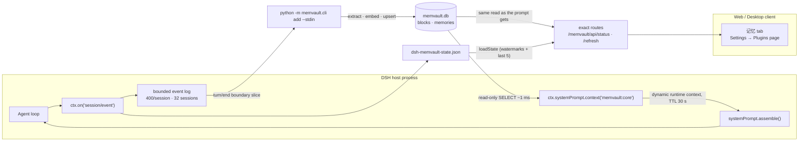

# dsh-memvault

<p align="center">
  <strong>Push MemVault's core memory into the DeepSeek Harness system prompt — and let every finished turn flow back.</strong><br>
  With a memory panel in the GUI · zero runtime dependencies · no bundler · no second server
</p>

<p align="center">
  <strong>English</strong> | <a href="README.zh.md">中文</a>
</p>

<p align="center">
  
  
  
  
  
  
  
</p>

---

**dsh-memvault** is the missing half of a memory system that already exists. **MemVault** (a local long-term-memory service: a SQLite store, a FastAPI/CLI pipeline and a stdio MCP server) stores facts, embeds them and retrieves them — but it is a **stdio MCP server**, and MCP is a *pull* protocol: the server can only be *called*, it has no channel to put anything into the model's context. So "memory is already loaded" can never be achieved from the MCP side. It has to be done by the client, which is this plugin.

The plugin does three things:

| Half | What it does | Mechanism |
|---|---|---|
| **Inject** (read) | Core memory blocks enter the system prompt, visible on **every** step without the model calling a tool | `ctx.systemPrompt.context()` — a dynamic runtime-context contribution (the same channel as `skill-catalog`) |
| **Extract** (write) | Every *N*th finished turn, the turn's transcript is handed to MemVault's extraction/embedding pipeline | `ctx.on('session/event')` → `turn/end` → `python -m memvault.cli add --stdin` |
| **Show** (panel) | What is injected right now, what extraction has been doing, and **editing the core blocks themselves** | three exact host routes (`/memvault/api/*`) + a browser half rendered as a conversation tab and a Plugins settings page |

## ✨ Features

| | |
|---|---|
| 🧠 **Injection without tool calls** | Core blocks land in a dynamic runtime context, so they are re-evaluated on every `assemble()` and the model simply *has* them |
| 🗄️ **Direct read-only SQLite** | Node's built-in `node:sqlite` opens `memvault.db` read-only — no HTTP hop, no subprocess, no third-party dependency, no server that must be up |
| 💾 **TTL-cached rendering** | The system prompt *is* the KV-cache prefix; re-reading and re-rendering every step is wasted work and any byte change invalidates reuse — so the render is cached (`refreshMs`, default 30 s) |
| 🧩 **Turn-boundary slicing** | The write half slices the turn from its own bounded event log by `turn/end` boundaries: idempotent, restart-proof, no watermark arithmetic to go stale |
| ⏱️ **Cost-aware extraction** | `everyNTurns` throttles the Python process, `minTranscriptChars` skips trivia, `endReasons` decides which turn endings count, `timeoutMs` kills a stuck child |
| 🎭 **Role filtering** | Assistant prose and tool traffic are excluded by default — shipping them stored the model's own words as "facts about the user" |
| 🪶 **Zero runtime dependencies** | Plain ESM over the harness plugin protocol: `node:sqlite`, `node:child_process`, `node:fs`. Nothing to install, and the browser half is hand-written against the ModuleLoader envelope instead of being bundled |
| 🎛️ **A real panel** | A **记忆** tab in the conversation ring and a page under Settings → Plugins: the blocks currently injected (label, scope, characters against their stored limit, text), the read budget and cache age, the extraction knobs, sessions with a watermark, and the last five extraction outcomes — plus a **立即重读** button that ignores the 30 s render TTL |
| ✏️ **Editable core blocks** | 编辑 / 删除 on any block, and a form to create one. A write is an upsert keyed by `(scope_type, scope_id, label)`, it drops the render cache so the next step already sees it, and `panel.writes: false` turns the whole thing read-only |
| 🖥️ **Host half needs no browser** | The panel is optional: `webServer` is taken with `ctx.inject`, so a headless composition still injects memory and simply never registers the routes |
| 🛟 **Fail-soft by design** | An unreadable store serves the last good text and warns once; a broken extraction never fails a turn and never poisons the next one |
| 🔍 **Observable from outside** | Watermarks and the last five extraction diagnostics are written atomically to one JSON file, so "hook never fired" is distinguishable from "turn too short" from "ran and found nothing" |

## 🧭 Compatibility

| Question | Answer |
|---|---|
| **DSH Desktop** | ✅ Verified live on the reserved `desktop` profile: the bundle (`dsh.bundle.patch`) loads, the plugin row is `active`, and the injected blocks appear in the runtime-context snapshot. |
| **Do I need a client half?** | Only for the panel. `dsh.client.platform: 'web'` serves the browser half; the memory bridge itself runs entirely host-side, so disabling the client half costs visibility, never injection. |
| **DSH Web / headless / SDK profiles** | ✅ The same bundle works wherever the host runs. Headless compositions simply have no `webServer`, and the panel's child fiber waits for it instead of failing. `systemPrompt` is the only *required* service. |
| **Is the panel visible?** | ✅ Two seats: a **记忆** tab beside 聊天 / 轨迹 in the conversation ring, and a **MemVault 记忆桥** page under Settings → Plugins. Both are read-only views over the injected blocks and the extraction state. |
| **Windows / macOS / Linux** | ✅ Windows works out of the box with the author's layout; on other platforms point `MEMVAULT_DIR` / `MEMVAULT_PYTHON` at the checkout (a POSIX venv uses `.venv/bin/python`), or set the three paths in `cordis.patch.yml`. |
| **Node** | `>= 22.13` (flag-free `node:sqlite`). DSH ships its own Node, so this is only a statement about the plugin's API floor. |
| **Other harnesses (Claude Code, Codex, …)** | ❌ Not this plugin. It is written against the cordis/DSH surface (`ctx.systemPrompt.context`, `session/event`). Those harnesses reach the same store through MemVault's own MCP tools, CLI, or API. |

## 🚀 Quick start

**Prerequisite:** a working MemVault checkout — its virtualenv and its `memvault.db` (the store is shared with the MemVault service and MCP clients; this plugin only ever `SELECT`s from it).

Self-owned install (what this repo does on the author's machine):

```jsonc
// ~/.dsh/profiles/<profile>/package.json
{
  "dependencies": { "dsh-memvault": "link:D:/_Projects/skill_mcp/dsh-memvault" },
  "dsh": { "profile": { "bundles": ["…", "dsh-memvault", "…"] } }
}
```

```powershell
# make the module resolvable from the profile
New-Item -ItemType Junction `
  -Path "$env:USERPROFILE\.dsh\profiles\desktop\node_modules\dsh-memvault" `
  -Target "D:\_Projects\skill_mcp\dsh-memvault"
```

**Restart DSH after adding a bundle** — an already-loaded patch file hot-reloads, a newly added bundle does not.

> ⚠️ Two known traps. `dsh plugin add` rewrites the profile's `package.json`, and the `dsh.profile.bundles` array can silently lose *other* plugins' entries — always re-read the whole list afterwards. And pnpm can replace the `link:` junction; recreate it if the bundle suddenly stops loading.

Installing from npm or a git spec is the same operation through `dsh plugin` or the Web sidebar's **Plugins** page (see `@deepseek-ai/dsh-plugin-manager`).

The browser half is committed as `lib/client.js`, so a fresh clone needs no build. After editing `src/client/index.js`:

```bash
npm run build     # wraps the client source in the ModuleLoader envelope
npm test          # fails when lib/client.js is stale
```

A brand-new client half is picked up by a **restart** plus a page reload: the boot graph is rendered into the index response.

## ⚙️ Configuration

Everything is a code default; a `config` block in `cordis.patch.yml` overrides it.

### Read half

| Field | Default | Meaning |
|---|---|---|
| `enabled` | `true` | `false` injects the empty string forever |
| `dbPath` | `$MEMVAULT_DB_PATH` else `D:/Claude_code/memory/data/memvault.db` | Path to `memvault.db` |
| `scopes` | `[{user,lenovo},{agent,claude-code-memory}]` | Blocks are keyed by `(scope_type, scope_id)`; **both halves must be given explicitly** — a foreign process has no "current scope" |
| `labels` | `[]` | Only these labels; empty means every block in the scopes |
| `maxChars` | `4000` | Budget for the **whole rendered string**, header included |
| `refreshMs` | `30000` | TTL for the cached render |
| `order` | `210` | Position among runtime-context contributions (e.g. relative to `skill-catalog`) |
| `name` | `memvault:core` | The name shown in the trajectory's injected-context list |

### Write half (`config.extract`)

| Field | Default | Meaning |
|---|---|---|
| `enabled` | `true` | `false` makes the plugin read-only |
| `everyNTurns` | `3` | Extract once per N **finished** turns; `1` = every turn |
| `endReasons` | `['completed','max-tokens']` | Which `turn/end` reasons count. `aborted` / `error` / `interrupted` / `blocked` are skipped — but `max-tokens` is not, because a truncated turn still holds the user's message |
| `includeAssistant` / `includeTools` | `false` / `false` | The extractor does not separate roles; the assistant's own prose became stored "facts", so it is off by default |
| `maxInputChars` | `6000` | Transcript budget; newest lines win, oldest are dropped |
| `minTranscriptChars` | `40` | Below this a turn is not worth a process plus an LLM call — it is skipped, and the watermark still advances |
| `timeoutMs` | `120000` | Timeout kills the child and records one warning |
| `pythonPath` | `$MEMVAULT_PYTHON` else `<MEMVAULT_DIR>/.venv/{Scripts/python.exe,bin/python}` | Interpreter that can `import memvault` |
| `projectDir` | `$MEMVAULT_DIR` else `D:/Claude_code/memory` | Working directory of the child |
| `user` / `agent` / `run` | `lenovo` / `claude-code-memory` / unset | The three axes are orthogonal; any combination is allowed |
| `env` | `{PYTHONUTF8:'1', PYTHONIOENCODING:'utf-8'}` | Child environment. Removing these reintroduces the cp936/emoji bug below |
| `statePath` | `~/.dsh/storages/dsh-memvault-state.json` | Watermarks + the last five diagnostics; atomic write |

### Panel routes

The browser half has no knobs of its own; it reads the two routes the host half registers. They exist only when the composition provides `webServer`.

| Route | Method | Answers |
|---|---|---|
| `/memvault/api/status` | `GET` | Injected blocks (label, scope, characters, stored limit, value clamped to 2000), read config, cache age, extraction config, watermark session count, last five diagnostics, and whether writes are enabled |
| `/memvault/api/refresh` | `POST` | The same payload after dropping the render TTL — the 立即重读 button |
| `/memvault/api/blocks` | `POST` | One block action through MemVault's CLI: `{ action: 'set', type, id, label, value, limit? }` (upsert) or `{ action: 'delete', type, id, label }` |

The handlers refuse anything that is not a loopback `Host` with a matching `Origin` (when the browser sends one) and a same-site `Sec-Fetch-Site`, answering 403 otherwise. They are `exact` routes, so they match before the shell's index/`/api` handlers. A bad action, an unknown scope type, an empty value or an over-long value is a 400 before anything is spawned; a CLI failure is a 502.

### Panel

| Field | Default | Meaning |
|---|---|---|
| `panel.writes` | `true` | `false` makes the panel read-only: `/memvault/api/blocks` answers 403 instead of running the CLI |

## 🏗️ How it works



Read path, per step:

1. `assemble()` asks every dynamic context for its text.
2. `memvault:core` returns the cached render unless the TTL expired; on expiry it opens the store read-only and re-renders.
3. Blocks are rendered as `- [scope_type/scope_id/label] value`, headed by one attribution line, bounded by `maxChars`.
4. An empty render returns `''`, the assembler drops the empty contribution, and nothing appears in the trajectory — that is the intended behaviour for an empty store, not a fault.

Write path, per finished turn:

1. Every appended session event is buffered per session (bounded on both axes).
2. On `turn/end` with an accepted reason, the turn counter advances.
3. Every `everyNTurns`-th turn is sliced **by turn boundary** from that buffer, rendered to a user-only transcript (oldest lines dropped first), and, if long enough, queued.
4. Extractions are serialized: one child at a time, and a failure in one turn cannot poison the next.
5. MemVault does the rest — LLM extraction, ADD/UPDATE/DELETE decisions, embeddings, relations — so written rows are actually *retrievable*.

Panel path, on open and every 15 s:

1. The browser half fetches `/memvault/api/status` from the same origin.
2. The handler re-reads only when the TTL says so, so a polling panel never becomes a per-second SQLite read; 立即重读 forces the read instead.
3. The payload reports the blocks **the prompt is getting**, not a second interpretation of the store — same reader, same scope/label filters, same budget.

## 🧪 Verification

No DSH and no browser needed:

```bash
npm test              # all four suites
npm run smoke:package # package/bundle contract: manifest, patch row, exports, peers, bundle id
npm run smoke         # reader + formatter + budget contract, against the real db (read-only)
npm run smoke:extract # transcript, boundary slicing, event buffer, watermarks, and a REAL end-to-end write into a throwaway db
npm run smoke:panel   # mounts the plugin on a stub context, drives both routes against a throwaway db, and runs the shipped client bundle under a stub ModuleLoader
```

`smoke:panel` is where the panel's behaviour is actually pinned down: the TTL must serve a stale render while a row written in between exists, `POST /refresh` must pick that row up, an untrusted `Host`/`Origin` must get 403, a throwing handler must become a 500 rather than reject, an unreadable store must still answer 200 with the blocks it last knew, and the shipped `lib/client.js` must equal what `src/client/index.js` builds to. Its write half runs **real CLI writes against a throwaway store**: the route creates a block, an upsert of the same label must not create a second one, a delete removes it, `panel.writes: false` turns the route into a 403, and a value that looks like an option (`--not-a-flag`) must survive argv parsing as data.

The end-to-end step forces the offline embedder and rule extractor in a temporary database: it never touches the real store and never calls the configured gateway.

**Live check.** After a restart, the trajectory's *injected context* list gains a `memvault:core` entry whose content is your actual blocks, the Plugins page shows the bundle's row (`memvault-core-context`) as active, and the **记忆** tab renders those same blocks with their character counts and the last extraction outcomes.

## 🧠 Design decisions

**Why a direct SQLite read rather than HTTP or the CLI.** `GET /api/v1/blocks` needs the FastAPI server alive on 8780 — if it is down, the prompt silently loses memory. Spawning the CLI costs ~200–300 ms per refresh. `node:sqlite` costs ~1 ms and depends on nothing running. The store is shared with the MemVault service, but this only `SELECT`s, and a `timeout: 2000` busy timeout keeps a concurrent writer from surfacing `SQLITE_BUSY` to the prompt assembler. `node:sqlite` is still *experimental* in Node 24 — a documented risk, and the reason the write half deliberately does not depend on it.

**Why the render is cached.** The system prompt is the KV-cache prefix. Re-reading and re-rendering on every step is wasted work, and any byte change invalidates cache reuse from that point on. Core blocks are edited by a human on the scale of hours; a 30 s TTL is both cheap and cache-friendly.

**Why the write half is a CLI call rather than a direct insert.** Writing rows straight into SQLite would skip extraction and embedding — the rows would exist and be unretrievable. `--stdin` rather than argv because a turn transcript blows past the command-line length limit. The cost is one Python process per extracted turn, which is exactly what `everyNTurns` and `minTranscriptChars` exist to control.

**Why only core blocks are injected, and not per-turn semantic recall.** Recall results change every turn; putting them in the system-prompt prefix would invalidate the cache on every step. That content belongs in a user message with its provenance, not in the prompt prefix.

**Why `turn/end` reasons are configurable.** The agent loop emits `completed`, `max-tokens`, `blocked`, `aborted`, `error`, plus `interrupted` from the repair path. Accepting only `completed` silently drops turns that ended on `max-tokens` — which still contain real user content.

**Why the browser half is hand-written instead of bundled.** A client bundle is served in the ModuleLoader envelope — `window.__ModuleLoader__.load({ id, factory })` — and resolving `require('react')` against the shell's platform seed table is all the "bundling" this panel needs. So `scripts/build-client.mjs` wraps the source in those two lines, and the package keeps zero dependencies: no esbuild, no `node_modules`, no build toolchain to keep alive. `src/client/index.js` is the readable source; `lib/client.js` is the committed artifact (the host serves built bundles and fails loudly when one is missing), and a test fails if the two ever drift.

**Why the panel registers with `ctx.inject`.** `webServer` is a *wanted* service, not a required one: a headless composition has no browser to render into, and a memory bridge that stopped injecting because nothing could paint a panel would be a bug, not a safety feature. `ctx.inject(['webServer'], …)` starts a child fiber that simply waits in that case.

**Why the panel routes check the caller themselves.** A route registered through `webServer` is not admitted by `dsh-client-connection` — that gate guards the index exchange and the `/api` bridge. The panel answers with the same request-trust rule the bridge documents (loopback host, matching `Origin` when present, no cross-site `Sec-Fetch-Site`) so a DNS-rebinding page cannot read **or write** the store. It is a boundary, not identity; the server still binds loopback only.

**Why the panel writes through the CLI too.** A core block is cheap to write — no LLM call, no embedding, unlike a memory — but it still has to go through MemVault's own `core_append`, which is what owns the upsert semantics, the `block.updated` event and `value_limit`. A direct SQLite `INSERT` would skip all three. The CLI takes the value as an argv positional, so the panel caps it at 8000 characters and puts `--` before the positionals: a value of `--not-a-flag` has to stay data.

**Why the panel's validation is stricter than MemVault's.** Two extra refusals, both about failures that would otherwise be invisible: an empty value (the prompt reader skips empty blocks, so such a write would look like nothing happened) and a value over 8000 characters (argv limits are real). Everything else is left to MemVault, which stays the source of truth.

## ⚠️ Known limits

- **No extraction window.** Extraction is synchronous and ships a single turn. Batching several turns and running asynchronously would be cheaper and give a better signal-to-noise ratio; today `includeAssistant: false` is the mitigation.
- **Source changes need a real host restart.** Editing the plugin's own `lib/*.js` (or its config) is only picked up by a genuine process restart — "refresh the UI" is not enough, and the symptom is simply *no change*. A **newly added client half additionally needs a page reload**, because the boot graph is rendered into the index response.
- **The panel edits core blocks, not memories.** Create / replace / delete on the stable `(scope_type, scope_id, label)` blocks only. It never writes a memory (that goes through extraction, embeddings included) and it never triggers an extraction by hand.
- **`node:sqlite` is experimental** in the Node versions DSH currently ships.
- **Machine-specific defaults.** `scopes` defaults to the author's `(user, lenovo)` / `(agent, claude-code-memory)` pairs, and the shipped patch points at the author's checkout. Both are meant to be edited.

## 🗺️ Roadmap

- **Async, windowed extraction** — accumulate N turns or idle out, then extract in the background.
- **A config schema** so the Plugins page can edit the knobs instead of a hand-written patch (the panel's page is the natural home for it).
- **Memory browsing in the panel** — a second tab over `memory_search` results, with the same read-only discipline the core blocks had.

## 📄 License

[MIT](./LICENSE) © 2026 zhang66633

Development notes, every dead end and every measured pitfall live in [docs/DEVLOG.md](docs/DEVLOG.md).
