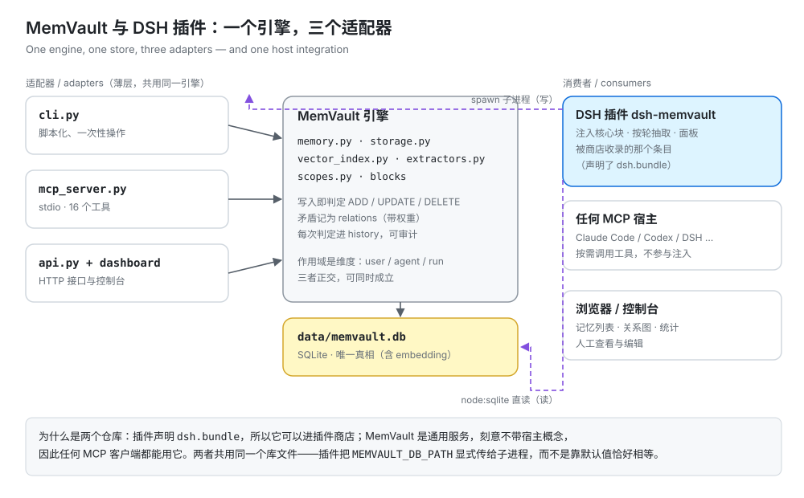
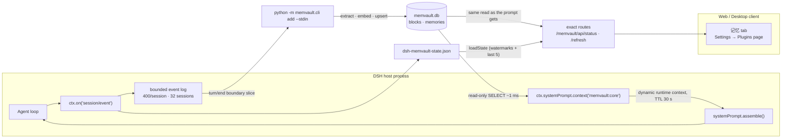
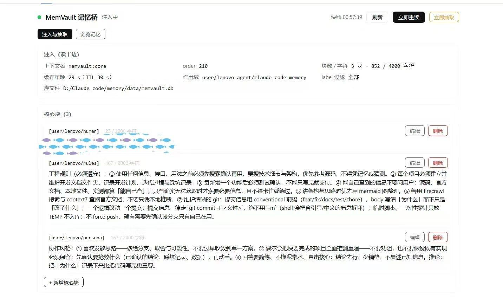
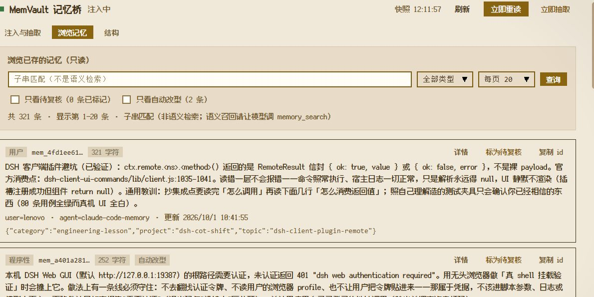

# dsh-memvault

<p align="center">
  <strong>Push MemVault's core memory into the DeepSeek Harness system prompt — and let every finished turn flow back.</strong><br>
  With a memory panel in the GUI · zero runtime dependencies · no bundler · no second server
</p>

<p align="center">
  <strong>English</strong> | <a href="README.zh.md">中文</a>
</p>

<p align="center">
  
  
  
  
  
  
  
</p>

---

**dsh-memvault** is the missing half of a memory system that already exists. **[MemVault](https://github.com/zhang66633/memvault)** (a local long-term-memory service: a SQLite store, a FastAPI/CLI pipeline and a stdio MCP server) stores facts, embeds them and retrieves them — but it is a **stdio MCP server**, and MCP is a *pull* protocol: the server can only be *called*, it has no channel to put anything into the model's context. So "memory is already loaded" can never be achieved from the MCP side. It has to be done by the client, which is this plugin.

The two halves are deliberately separable: **MemVault alone is a general MCP service** any client can use (Claude Code, Cursor, Cline, a script), and **this plugin is the DSH-specific layer** — prompt injection, windowed turn extraction through MemVault's own pipeline, and the panel. Installing the plugin is what makes memory *already there* instead of something the model has to remember to look up.

The plugin does three things:

| Half | What it does | Mechanism |
|---|---|---|
| **Inject** (read) | Core memory blocks enter the system prompt, visible on **every** step without the model calling a tool | `ctx.systemPrompt.context()` — a dynamic runtime-context contribution (the same channel as `skill-catalog`) |
| **Extract** (write) | Finished turns accumulate into a window, and the window is handed to MemVault's extraction/embedding pipeline as **one** conversation | `ctx.on('session/event')` → `turn/end` → window → `python -m memvault.cli add --stdin` (idle-triggered) |
| **Show** (panel) | What is injected right now, what extraction has been doing, **editing the core blocks**, and **browsing what is actually stored** | five exact host routes (`/memvault/api/*`) + a browser half rendered as a conversation tab and a Plugins settings page |

## ✨ Features

| | |
|---|---|
| 🧠 **Injection without tool calls** | Core blocks land in a dynamic runtime context, so they are re-evaluated on every `assemble()` and the model simply *has* them |
| 🗄️ **Direct read-only SQLite** | Node's built-in `node:sqlite` opens `memvault.db` read-only — no HTTP hop, no subprocess, no third-party dependency, no server that must be up |
| 💾 **TTL-cached rendering** | The system prompt *is* the KV-cache prefix; re-reading and re-rendering every step is wasted work and any byte change invalidates reuse — so the render is cached (`refreshMs`, default 30 s) |
| 🧩 **Turn-boundary slicing** | The write half slices the turn from its own bounded event log by `turn/end` boundaries: idempotent, restart-proof, no watermark arithmetic to go stale |
| ⏱️ **Cost-aware extraction** | The window is a knob: `everyNTurns` decides when extraction becomes worth considering, `idleMs` waits for a pause, `windowTurns` caps it, `minTranscriptChars` skips trivia, `endReasons` decides which turn endings count, `timeoutMs` kills a stuck child |
| 🌙 **Background, not on the critical path** | Extraction runs when the session goes quiet — during a pause, not while you are waiting for an answer — and one call covers up to `windowTurns` turns instead of one call per turn |
| 💾 **Restart-safe window** | The waiting window (its rendered transcript, bounded) is written to the state file on every turn, so a restart between turns does not silently drop memories; anything still pending is extracted on mount and marked as recovered |
| 🎭 **Role filtering** | Assistant prose and tool traffic are excluded by default — shipping them stored the model's own words as "facts about the user" |
| 🪶 **Zero runtime dependencies** | Plain ESM over the harness plugin protocol: `node:sqlite`, `node:child_process`, `node:fs`. Nothing to install, and the browser half is hand-written against the ModuleLoader envelope instead of being bundled |
| 🧾 **Every knob described once** | One spec (`lib/config.js`) produces the code defaults, the `Config` schema DSH validates against, and the settings the Plugins page renders — so a default cannot drift between them, and a typo in a patch shows up in the panel instead of only in the log |
| 🎛️ **A real panel** | A **记忆** tab in the conversation ring and a page under Settings → Plugins: the blocks currently injected (label, scope, characters against their stored limit, text), the read budget and cache age, the extraction knobs, sessions with a watermark, and the last five extraction outcomes — plus a **立即重读** button that ignores the 30 s render TTL |
| ✏️ **Editable core blocks** | 编辑 / 删除 on any block, and a form to create one. A write is an upsert keyed by `(scope_type, scope_id, label)`, it drops the render cache so the next step already sees it, and `panel.writes: false` turns the whole thing read-only |
| 🧭 **Know your paths at setup** | The panel shows which store file, plugin state file, Python and project directory are in play, whether the store file exists (and its size), and which scopes are **read** versus **written** — plus the only two places to change any of it: the DSH plugin config or MemVault's `.env`. A missing store file is called out as "created on the first write", because a wrong path and an empty store look identical in a row count The paths in the shipped `cordis.patch.yml` are one machine's example rather than defaults: change them, or change nothing and let discovery find your checkout |
| 🔭 **See the structure** | A third view answers what a list cannot: which scope **dimensions** hold what (and that one row counts under both `user` and `agent` — scopes are dimensions, not a partition), which core blocks are actually injected versus merely stored, and how the relation graph is shaped — nodes sized by degree, edges by weight, plus how many memories have **no** edge at all. Clicking a node opens its full audit chain |
| 🔎 **Browse what is stored** | A second view searches the `memories` table by substring with type/scope filters and paging, showing type, scope, age and the id (one click to copy, so a tool call can act on it). Rows the store **retyped** on its own carry a badge, and "only retyped" lists exactly those — a heuristic verdict should not be silent, so a wrong one can be marked for review right there. It is a **browse**, not retrieval — semantic recall stays with the model's `memory_search` — and it never selects the embedding blob |
| 🧾 **Trace and review** | Every extraction records **which memories it produced**, so a window links to its rows ("看这 2 条产出"). Each row can open its provenance — MemVault's own audit trail (`history`: ADD/UPDATE/DELETE with old and new text) and the contradictions it takes part in (`relations`) — and can be **marked for review**. Flags are plugin state: the store is never touched |
| ♻️ **A review loop that can act** | The queue resolves each flagged memory with its window and retained input, and a mark can be **cleared right there**. Two actions: **复制修正请求** hands the model the ids, texts and provenance (it proposes; DSH's approval is the gate), and **重抽** sends that window's text through MemVault's own pipeline again — optionally edited, optionally with the other extractor. Replay is the panel's one store-writing action, and it writes through `add()`, never around it |
| 🖥️ **Host half needs no browser** | The panel is optional: `webServer` is taken with `ctx.inject`, so a headless composition still injects memory and simply never registers the routes |
| 🛟 **Fail-soft by design** | An unreadable store serves the last good text and warns once; a broken extraction never fails a turn and never poisons the next one |
| 🔍 **Observable from outside** | Watermarks and the last five extraction diagnostics are written atomically to one JSON file, so "hook never fired" is distinguishable from "turn too short" from "ran and found nothing" |

## 🧭 Compatibility

| Question | Answer |
|---|---|
| **DSH Desktop** | ✅ Verified live on the reserved `desktop` profile: the bundle (`dsh.bundle.patch`) loads, the plugin row is `active`, and the injected blocks appear in the runtime-context snapshot. |
| **Do I need a client half?** | Only for the panel. `dsh.client.platform: 'web'` serves the browser half; the memory bridge itself runs entirely host-side, so disabling the client half costs visibility, never injection. |
| **DSH Web / headless / SDK profiles** | ✅ The same bundle works wherever the host runs. Headless compositions simply have no `webServer`, and the panel's child fiber waits for it instead of failing. `systemPrompt` is the only *required* service. |
| **Is the panel visible?** | ✅ Two seats: a **记忆** tab beside 聊天 / 轨迹 in the conversation ring, and a **MemVault 记忆桥** page under Settings → Plugins. Both are read-only views over the injected blocks and the extraction state. |
| **Windows / macOS / Linux** | ✅ Windows works out of the box with the author's layout; on other platforms point `MEMVAULT_DIR` / `MEMVAULT_PYTHON` at the checkout (a POSIX venv uses `.venv/bin/python`), or set the three paths in `cordis.patch.yml`. |
| **Node** | `>= 22.13` (flag-free `node:sqlite`). DSH ships its own Node, so this is only a statement about the plugin's API floor. |
| **Other harnesses (Claude Code, Codex, …)** | ❌ Not this plugin. It is written against the cordis/DSH surface (`ctx.systemPrompt.context`, `session/event`). Those harnesses reach the same store through MemVault's own MCP tools, CLI, or API. |

## 🚀 Quick start

**Prerequisite:** a working MemVault checkout — its virtualenv and its `memvault.db` (the store is shared with the MemVault service and MCP clients; this plugin only ever `SELECT`s from it).

Self-owned install (what this repo does on the author's machine):

```jsonc
// ~/.dsh/profiles/<profile>/package.json
{
  "dependencies": { "dsh-memvault": "link:D:/_Projects/skill_mcp/dsh-memvault" },
  "dsh": { "profile": { "bundles": ["…", "dsh-memvault", "…"] } }
}
```

```powershell
# make the module resolvable from the profile
New-Item -ItemType Junction `
  -Path "$env:USERPROFILE\.dsh\profiles\desktop\node_modules\dsh-memvault" `
  -Target "D:\_Projects\skill_mcp\dsh-memvault"
```

**Restart DSH after adding a bundle** — an already-loaded patch file hot-reloads, a newly added bundle does not.

> ⚠️ Two known traps. `dsh plugin add` rewrites the profile's `package.json`, and the `dsh.profile.bundles` array can silently lose *other* plugins' entries — always re-read the whole list afterwards. And pnpm can replace the `link:` junction; recreate it if the bundle suddenly stops loading.

Installing from npm or a git spec is the same operation through `dsh plugin` or the Web sidebar's **Plugins** page (see `@deepseek-ai/dsh-plugin-manager`).

The browser half is committed as `lib/client.js`, so a fresh clone needs no build. After editing `src/client/index.js`:

```bash
npm run build     # wraps the client source in the ModuleLoader envelope
npm test          # fails when lib/client.js is stale
```

A brand-new client half is picked up by a **restart** plus a page reload: the boot graph is rendered into the index response.

## ⚙️ Configuration

Every knob is described **once**, in `lib/config.js`: type, bounds, default and a
description. From that one description come the code defaults (`DEFAULT_EXTRACT`
and friends), the `Config` schema DSH validates the entry against and projects for
the Plugins page, and the panel's view of what is configured. The tables below are
that description in prose.

Setting values is unchanged — a `config` block in `cordis.patch.yml`. What changed
is what happens when one is wrong: a value that does not type-check is reported
(and the default is used), an undeclared key is reported, and both surface as a
warning banner in the panel rather than only in the host log.

### Read half

| Field | Default | Meaning |
|---|---|---|
| `enabled` | `true` | `false` injects the empty string forever |
| `dbPath` | `$MEMVAULT_DB_PATH` else `D:/Claude_code/memory/data/memvault.db` | Path to `memvault.db` |
| `scopes` | `[{user,lenovo},{agent,claude-code-memory}]` | Blocks are keyed by `(scope_type, scope_id)`; **both halves must be given explicitly** — a foreign process has no "current scope" |
| `labels` | `[]` | Only these labels; empty means every block in the scopes |
| `maxChars` | `4000` | Budget for the **whole rendered string**, header included |
| `refreshMs` | `30000` | TTL for the cached render |
| `order` | `210` | Position among runtime-context contributions (e.g. relative to `skill-catalog`) |
| `name` | `memvault:core` | The name shown in the trajectory's injected-context list |

### Write half (`config.extract`)

| Field | Default | Meaning |
|---|---|---|
| `enabled` | `true` | `false` makes the plugin read-only |
| `everyNTurns` | `3` | Turns that must accumulate before an extraction is considered; `1` = every turn (still windowed) |
| `idleMs` | `20000` | Quiet time that hands the window over. A new finished turn re-arms it |
| `windowTurns` | `8` | Hard cap: reaching this many turns extracts immediately, so a session that never pauses still gets extracted |
| `endReasons` | `['completed','max-tokens']` | Which `turn/end` reasons count. `aborted` / `error` / `interrupted` / `blocked` are skipped — but `max-tokens` is not, because a truncated turn still holds the user's message |
| `includeAssistant` / `includeTools` | `false` / `false` | The extractor does not separate roles; the assistant's own prose became stored "facts", so it is off by default |
| `maxInputChars` | `6000` | Transcript budget; newest lines win, oldest are dropped |
| `minTranscriptChars` | `40` | Below this a turn is not worth a process plus an LLM call — it is skipped, and the watermark still advances |
| `timeoutMs` | `120000` | Timeout kills the child and records one warning |
| `pythonPath` | `$MEMVAULT_PYTHON` else `<MEMVAULT_DIR>/.venv/{Scripts/python.exe,bin/python}` | Interpreter that can `import memvault` |
| `projectDir` | `$MEMVAULT_DIR` else `D:/Claude_code/memory` | Working directory of the child |
| `user` / `agent` / `run` | `lenovo` / `claude-code-memory` / unset | The three axes are orthogonal; any combination is allowed |
| `env` | `{PYTHONUTF8:'1', PYTHONIOENCODING:'utf-8'}` | Child environment. Removing these reintroduces the cp936/emoji bug below |
| `statePath` | `~/.dsh/storages/dsh-memvault-state.json` | Watermarks + the last five diagnostics; atomic write |

### Panel routes

The browser half has no knobs of its own; it reads the two routes the host half registers. They exist only when the composition provides `webServer`.

| Route | Method | Answers |
|---|---|---|
| `/memvault/api/status` | `GET` | Injected blocks (label, scope, characters, stored limit, value clamped to 2000), read config, cache age, extraction config, watermark session count, last five diagnostics, and whether writes are enabled |
| `/memvault/api/refresh` | `POST` | The same payload after dropping the render TTL — the 立即重读 button |
| `/memvault/api/blocks` | `POST` | One block action through MemVault's CLI: `{ action: 'set', type, id, label, value, limit? }` (upsert) or `{ action: 'delete', type, id, label }` |
| `/memvault/api/flush` | `POST` | Extract every pending window now (the 立即抽取 button). The answer says how many sessions were handed over; the work stays queued. Answers 405 when extraction is disabled |
| `/memvault/api/memories` | `GET` | Browse stored memories: `q` (substring), `type`, `user`, `agent`, `run`, `ids` (an explicit id list, how a diagnostic's output is looked up), `flagged=1` (only marked rows), `retyped=1` (only rows the store's own type refinement moved out of `user`), `limit` (default 20, capped at 200), `offset`. Answers `{ rows, total, limit, offset, order, applied, mode, flags, flaggedCount, retypedCount, produced }` — `applied` echoes what was actually used, and `mode: 'substring'` says out loud that this is not ranked retrieval |
| `/memvault/api/memory` | `GET` | One memory's provenance (`?id=`): the row, `history` (every audited decision with old/new text) and `relations` (the contradictions, with the other side's text and weight). 404 for an unknown id, `missing: true` in the body |
| `/memvault/api/flag` | `POST` | Mark or clear one memory for review: `{ id, flagged: true \| false, note? }`. Writes the plugin's **own state file** — MemVault is untouched — and answers with the whole bounded flag map. 403 when `panel.writes: false` |
| `/memvault/api/review` | `GET` | The review queue: every flagged memory with its provenance, the window that produced it, whether that window's input is still retained (`replayable`), the retained `inputText` when it is, and `request` — a ready-to-paste instruction listing ids, texts and provenance for a model to propose fixes |
| `/memvault/api/replay` | `POST` | Replay one retained input: `{ key, text?, extractor?: 'inherit' \| 'rule' \| 'llm' }`. Answers **202** because the work is queued; the outcome appears as a diagnostic with `replayOf`. Writes the store through MemVault's own `add()`; 403 when `panel.writes: false` |
| `/memvault/api/structure` | `GET` | The store's shape: memories and type split per scope dimension, core blocks with their occupancy (`chars / value_limit`) and whether each is actually injected, the relation graph's nodes and edges (capped at 120 each, `sampled` reported when truncated), the ten heaviest relations, and how many memories have no edge at all. A store file that does not exist yet answers 200 with `initialized: false` — a fresh install is a state, not an error |

The handlers refuse anything that is not a loopback `Host` with a matching `Origin` (when the browser sends one) and a same-site `Sec-Fetch-Site`, answering 403 otherwise. They are `exact` routes, so they match before the shell's index/`/api` handlers. A bad action, an unknown scope type, an empty value or an over-long value is a 400 before anything is spawned; a CLI failure is a 502.

### Panel

| Field | Default | Meaning |
|---|---|---|
| `panel.writes` | `true` | `false` makes the panel read-only: `/memvault/api/blocks` answers 403 instead of running the CLI |

### Config schema

`lib/schema.js` builds a native Schemastery schema from the same spec and exports
it as `Config`, which is what DSH reads off a plugin module. Two consequences:

- **validation.** A config that fails the schema keeps the entry from activating
  (DSH's documented behaviour), so the schema is stricter than the resolver on
  purpose: bounds and types are enforced before the plugin runs.
- **a settings page.** `dsh --dump-config-schema` and the Plugins page project the
  same schema into JSON Schema, which is what renders the fields.

`@deepseek-ai/schemastery` comes from the DSH runtime and is declared as a peer.
The import is attempted once and tolerated when absent, because the bundled smoke
tests run on plain Node: outside DSH the plugin exports no `Config`, still loads,
and warns that it has no settings page. In DSH it always resolves.



## 🏗️ How it works



Read path, per step:

1. `assemble()` asks every dynamic context for its text.
2. `memvault:core` returns the cached render unless the TTL expired; on expiry it opens the store read-only and re-renders.
3. Blocks are rendered as `- [scope_type/scope_id/label] value`, headed by one attribution line, bounded by `maxChars`.
4. An empty render returns `''`, the assembler drops the empty contribution, and nothing appears in the trajectory — that is the intended behaviour for an empty store, not a fault.

Write path, per finished turn:

1. Every appended session event is buffered per session (bounded on both axes).
2. On `turn/end` with an accepted reason, the turn is sliced **by turn boundary** from that buffer and pushed onto the session's window.
3. The window decides: below `everyNTurns` it keeps waiting; at `everyNTurns` it arms an idle timer; at `windowTurns` — or when the timer fires — it hands the whole window over, as the newest lines of one bounded, user-only transcript.
4. The window is persisted on every push, so a restart between turns loses nothing; a window still waiting at mount is extracted and marked `recovered`.
5. Extractions are serialized: one child at a time, and a failure in one window cannot poison the next.
6. MemVault does the rest — LLM extraction, ADD/UPDATE/DELETE decisions, embeddings, relations — so written rows are actually *retrievable*.

Panel path, on open and every 15 s:

1. The browser half fetches `/memvault/api/status` from the same origin.
2. The handler re-reads only when the TTL says so, so a polling panel never becomes a per-second SQLite read; 立即重读 forces the read instead.
3. The payload reports the blocks **the prompt is getting**, not a second interpretation of the store — same reader, same scope/label filters, same budget.

## 📸 What it looks like

**Injection is the headline.** Every step, the core blocks are assembled into the system
prompt — no tool call, no round trip, no "did the model remember to look". The panel
shows the rendered budget, the scopes it read, and the blocks themselves:



**Memory structure** — scope dimensions, which blocks actually reach the prompt, and the
relation graph (only the 40 heaviest edges, or 120 nodes become an unreadable ring):


**Browsing** is a substring browse, not retrieval — with review marks and a flag on rows
the store retyped on its own:



## 🧪 Verification

No DSH and no browser needed:

```bash
npm test              # all five suites
npm run smoke:package # package/bundle contract: manifest, patch row, exports, peers, bundle id
npm run smoke:config  # the config spec, the resolver, and the native schema built from it
npm run smoke         # reader + formatter + budget contract, against the real db (read-only)
npm run smoke:extract # transcript, boundary slicing, event buffer, watermarks, and a REAL end-to-end write into a throwaway db
npm run smoke:panel   # mounts the plugin on a stub context, drives every route against a throwaway db, and runs the shipped client bundle under a stub ModuleLoader
```

`smoke:config` is the one that keeps the three copies of a default from existing:
it asserts that `DEFAULT_EXTRACT` *is* the spec default, that the native schema
validated against `{}` returns exactly those defaults, and that the **shipped
`cordis.patch.yml`** resolves with nothing unknown and nothing mistyped. It has
already earned its keep — see §9 of the [DEVLOG](docs/DEVLOG.md).

`smoke:panel` is where the panel's behaviour is actually pinned down: the TTL must serve a stale render while a row written in between exists, `POST /refresh` must pick that row up, an untrusted `Host`/`Origin` must get 403, a throwing handler must become a 500 rather than reject, an unreadable store must still answer 200 with the blocks it last knew, and the shipped `lib/client.js` must equal what `src/client/index.js` builds to. Its write half runs **real CLI writes against a throwaway store**: the route creates a block, an upsert of the same label must not create a second one, a delete removes it, `panel.writes: false` turns the route into a 403, and a value that looks like an option (`--not-a-flag`) must survive argv parsing as data.

The end-to-end step forces the offline embedder and rule extractor in a temporary database: it never touches the real store and never calls the configured gateway. `smoke:panel` goes one step further for the window: it feeds two finished turns through the real `session/event` handler, checks the waiting window is reported and persisted, flushes it through the route, and asserts the result is **one** call covering both turns whose two facts land in the store.

**Live check.** After a restart, the trajectory's *injected context* list gains a `memvault:core` entry whose content is your actual blocks, the Plugins page shows the bundle's row (`memvault-core-context`) as active, and the **记忆** tab renders those same blocks with their character counts and the last extraction outcomes.

## 🧠 Design decisions

**Why a direct SQLite read rather than HTTP or the CLI.** `GET /api/v1/blocks` needs the FastAPI server alive on 8780 — if it is down, the prompt silently loses memory. Spawning the CLI costs ~200–300 ms per refresh. `node:sqlite` costs ~1 ms and depends on nothing running. The store is shared with the MemVault service, but this only `SELECT`s, and a `timeout: 2000` busy timeout keeps a concurrent writer from surfacing `SQLITE_BUSY` to the prompt assembler. `node:sqlite` is still *experimental* in Node 24 — a documented risk, and the reason the write half deliberately does not depend on it.

**Why the render is cached.** The system prompt is the KV-cache prefix. Re-reading and re-rendering on every step is wasted work, and any byte change invalidates cache reuse from that point on. Core blocks are edited by a human on the scale of hours; a 30 s TTL is both cheap and cache-friendly.

**Why the write half is a CLI call rather than a direct insert.** Writing rows straight into SQLite would skip extraction and embedding — the rows would exist and be unretrievable. `--stdin` rather than argv because a turn transcript blows past the command-line length limit. The cost is one Python process per extracted turn, which is exactly what `everyNTurns` and `minTranscriptChars` exist to control.

**Why only core blocks are injected, and not per-turn semantic recall.** Recall results change every turn; putting them in the system-prompt prefix would invalidate the cache on every step. That content belongs in a user message with its provenance, not in the prompt prefix.

**Why `turn/end` reasons are configurable.** The agent loop emits `completed`, `max-tokens`, `blocked`, `aborted`, `error`, plus `interrupted` from the repair path. Accepting only `completed` silently drops turns that ended on `max-tokens` — which still contain real user content.

**Why the browser half is hand-written instead of bundled.** A client bundle is served in the ModuleLoader envelope — `window.__ModuleLoader__.load({ id, factory })` — and resolving `require('react')` against the shell's platform seed table is all the "bundling" this panel needs. So `scripts/build-client.mjs` wraps the source in those two lines, and the package keeps zero dependencies: no esbuild, no `node_modules`, no build toolchain to keep alive. `src/client/index.js` is the readable source; `lib/client.js` is the committed artifact (the host serves built bundles and fails loudly when one is missing), and a test fails if the two ever drift.

**Why the panel registers with `ctx.inject`.** `webServer` is a *wanted* service, not a required one: a headless composition has no browser to render into, and a memory bridge that stopped injecting because nothing could paint a panel would be a bug, not a safety feature. `ctx.inject(['webServer'], …)` starts a child fiber that simply waits in that case.

**Why the panel routes check the caller themselves.** A route registered through `webServer` is not admitted by `dsh-client-connection` — that gate guards the index exchange and the `/api` bridge. The panel answers with the same request-trust rule the bridge documents (loopback host, matching `Origin` when present, no cross-site `Sec-Fetch-Site`) so a DNS-rebinding page cannot read **or write** the store. It is a boundary, not identity; the server still binds loopback only.

**Why extraction is windowed and idle-triggered.** One call per turn was both expensive (a Python process plus an LLM call each time) and noisy: a single "yes, do it" turn carries almost no signal, while the three or four turns around a decision carry all of it. Waiting for quiet costs nothing — the work happens while you are reading, not while you are waiting — and `windowTurns` keeps a session that never pauses from postponing it forever. The whole policy is a pure function of pushes and timers (`window.js`), which is why it is tested with a fake clock rather than by waiting.

**Why the waiting window is written to disk.** Windowed extraction lengthens the "in flight" period from one turn to up to eight plus an idle timer, so anything held only in memory is exactly what a restart drops. Only the rendered transcript is stored, bounded by `maxInputChars`, and only for the newest few sessions — the file stays small, and recovery is marked `recovered: true` in the diagnostics so it is visible rather than mysterious.

**Why the config is a spec rather than just a schema.** A schema alone would have
to be the fourth place a default lives (constants, patch file, README, schema).
Describing each knob once — kind, bounds, default, description — lets the code
defaults, the validation and the settings page all be derived, and gives the
resolver something dependency-free to work from. The one thing that must stay in
step by hand is `window.js`'s standalone defaults, so a test asserts they match.

**Why the schema import is optional.** `@deepseek-ai/schemastery` is provided by
the DSH runtime, not by this package. A static import would make the module — and
therefore every smoke test — unloadable on plain Node, which is exactly where the
read, window, panel and contract tests run. So the import is attempted once,
`Config` is exported only when it succeeds, and `apply()` warns when it did not.
DSH never hits that path; the tests do, and they verify the schema with the real
Schemastery whenever the machine has one.

**Why replay goes through MemVault's `add()` instead of around it.** MemVault already
owns the write policy: `_decide` compares a new fact against the most similar
in-scope memory and picks ADD (below 0.55 similarity), DELETE (a negation), UPDATE
(same attribute slot, or ≥ 0.82 similarity), or ADD again for a paraphrase — that
0.55–0.82 band is *deliberately* allowed to coexist and is what `consolidate`
(≥ 0.92) later folds together. Routing a replay through the same door inherits all
of that, plus the `history` audit and the `relations` bookkeeping, for free; a
private "replace this row" rule in the panel would be a second, silently divergent
policy. Measured consequence: replaying a window whose text is unchanged updates
the **same rows in place** (identical ids before and after, no duplicates) because
the decision lands on UPDATE. A paraphrase the store decides to ADD stays until
`consolidate` runs — that is the trade, not a bug.

**Why the panel keeps the inputs it sent.** A replay needs the text, and after an
extraction the text used to be gone (only counts survived). The last five inputs
are retained, clamped, in the same state file — which also makes a *failed*
extraction replayable, and lets a human fix the input ("the extractor misread this
sentence") before sending it again.

**Why "the model proposes, the human approves" lives outside the plugin.** The
model already has MemVault's write tools, and DSH already gates tool calls with an
approval prompt. A second approval queue inside the plugin would duplicate that
gate and add a way for the panel to edit memories — exactly what it promises never
to do. So the plugin's half is the *evidence*: a request that carries ids, texts,
windows and provenance, plus a queue that shows what is flagged. Replay is the one
exception, because re-running the pipeline is extraction, not editing.

**Why a review flag is plugin state rather than a memory edit.** The one thing only
a human can supply is "this extracted fact is wrong", and recording it is useful;
acting on it is dangerous. So a flag is a timestamped note in the plugin's own
state file (bounded to 200, newest kept) — visible in the browse view, filterable,
and exportable later by a refine pass — while deleting or rewriting a memory stays
with `memory_delete` / `memory_update` / the CLI. That is what keeps the panel's
promise ("it never modifies your memories") literally true, and it is why flagging
is gated by the same `panel.writes` switch as block editing: read-only means
read-only.

**Why extraction records its output.** The CLI answers with every row it wrote
(`memory._public`, embeddings removed); keeping the ids turns "ok added=2" into
something auditable — the diagnostic links to the rows, and the panel can jump
straight from a window to what it produced. Twenty entries at 200 characters each
is enough to recognise a bad extraction and small enough to live in the state
file.

**Why the memory view is a substring browse.** Semantic ranking needs the embedder, and `memory_search`'s hybrid mode needs the keyword index too — that is the model's retrieval tool, and a panel that polled it would cost a retrieval per refresh. A `LIKE` over the text column is honest about being a browse: there is no index on `memories.memory`, so it is a scan, which is why the page is bounded (200 rows), the count is reported, and the payload says `mode: 'substring'`. Every value goes through a placeholder and `%`/`_` are escaped, so a query is a query and never a pattern or a statement.

**Why the browse never selects `*`.** `memories.embedding` is a blob per row; MemVault's own maintenance paths use an explicit column list for exactly that reason (`storage.iter_memory_meta`). Selecting the nine columns the panel displays keeps a browse cheap no matter how large the store is — it reads 289 rows on the author's store without touching a single embedding.

**Why the panel writes through the CLI too.** A core block is cheap to write — no LLM call, no embedding, unlike a memory — but it still has to go through MemVault's own `core_append`, which is what owns the upsert semantics, the `block.updated` event and `value_limit`. A direct SQLite `INSERT` would skip all three. The CLI takes the value as an argv positional, so the panel caps it at 8000 characters and puts `--` before the positionals: a value of `--not-a-flag` has to stay data.

**Why the panel's validation is stricter than MemVault's.** Two extra refusals, both about failures that would otherwise be invisible: an empty value (the prompt reader skips empty blocks, so such a write would look like nothing happened) and a value over 8000 characters (argv limits are real). Everything else is left to MemVault, which stays the source of truth.

## ⚠️ Known limits

- **Extraction lands after a pause, not instantly.** That is the point (the LLM call stays off the critical path), but it means a memory written now is normally visible after the session goes quiet for `idleMs` — or immediately via the panel's 立即抽取.
- **A window is text, not a log.** Recovery re-sends the rendered transcript, so it cannot re-derive turns that were not rendered (assistant prose and tool traffic are off by default anyway).
- **Replay re-sends text; it does not rewrite facts.** The stored transcript is what was sent, and MemVault decides what to do with it. A paraphrase the store chooses to ADD stays until `consolidate` (or the model, with your approval) removes it.
- **Only the last five extraction inputs are retained**, so older windows cannot be replayed; the queue says so per item (`replayable: false`).
- **The panel still never edits a memory.** It flags, traces, exports a request and replays extraction. Deleting or rewriting stays with the model's MemVault tools, behind DSH's approval — or with the CLI.
- **Source changes need a real host restart.** Editing the plugin's own `lib/*.js` (or its config) is only picked up by a genuine process restart — "refresh the UI" is not enough, and the symptom is simply *no change*. A **newly added client half additionally needs a page reload**, because the boot graph is rendered into the index response.
- **The panel edits core blocks, not memories.** Create / replace / delete on the stable `(scope_type, scope_id, label)` blocks only. It never writes a memory (that goes through extraction, embeddings included) and it never triggers an extraction by hand.
- **`node:sqlite` is experimental** in the Node versions DSH currently ships.
- **Machine-specific defaults.** `scopes` defaults to the author's `(user, lenovo)` / `(agent, claude-code-memory)` pairs, and the shipped patch points at the author's checkout. Both are meant to be edited.

## 🔌 Adding the MCP server (one paste)

Injection, extraction and the panel need **nothing** extra: install the bundle and they
work. Model-invoked recall (`memory_search`, relations, consolidate …) is a separate MCP
connection — not because of packaging, but because an external MCP server cannot inject
anything into the prompt, and this plugin cannot serve other clients.

The MCP connector imports an `mcpServers` block, so the whole setup is one paste

The same block lives in this repository as [`docs/mcp/memvault.mcp.json`](docs/mcp/memvault.mcp.json), ready to import.

(DSH → 🧩 MCP 连接器 → add → paste, or the `mcp_connector_import_json` tool):

```json
{
  "mcpServers": {
    "memvault": {
      "type": "stdio",
      "command": "D:/Claude_code/memory/.venv/Scripts/python.exe",
      "args": ["-m", "memvault.mcp_server"],
      "cwd": "D:/Claude_code/memory",
      "env": { "MEMVAULT_DB_PATH": "D:/Claude_code/memory/data/memvault.db" }
    }
  }
}
```

- **Keep the store path the same** as the plugin's `dbPath`. The plugin passes
  `MEMVAULT_DB_PATH` to every child process it spawns, so stating it here too makes both
  halves provably share one file instead of relying on two defaults agreeing.
- **Adjust `command` / `cwd`** to your checkout (and on Linux/macOS use
  `.venv/bin/python`).
- **Already running a `memvault` server?** Replace it rather than adding a second one:
  two connections with the same `serverName` collide on tool names.
- **Skipping the connector entirely?** Then skip this section — injection, extraction and
  the panel are unaffected; only on-demand search over the long tail is missing.

## 🗺️ Roadmap

- **Let the model consume the review request directly** — today it is copied and pasted; a tool that hands the queue over (still behind DSH's approval) would close the loop on the model's side.
- **A relations view** — the whole contradiction graph, clustered, rather than one memory's neighbourhood.

## 📄 License

[MIT](./LICENSE) © 2026 zhang66633

Development notes, every dead end and every measured pitfall live in [docs/DEVLOG.md](docs/DEVLOG.md).
