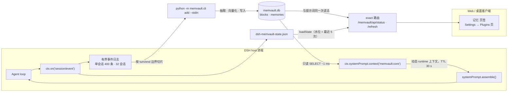

# dsh-memvault

<p align="center">
  <strong>把 MemVault 的核心记忆块推进 DeepSeek Harness 的 system prompt，再把每个完成的回合送回去。</strong><br>
  带一个 GUI 里的记忆面板 · 零运行时依赖 · 不需要打包器 · 不需要第二个常驻服务
</p>

<p align="center">
  <a href="README.md">English</a> | <strong>中文</strong>
</p>

<p align="center">
  
  
  
  
  
  
  
</p>

---

**dsh-memvault** 补齐的是一个**已经存在**的记忆系统缺掉的那一半。**[MemVault](https://github.com/zhang66633/memvault)**（本机长期记忆服务：SQLite 库 + FastAPI/CLI 管线 + stdio MCP server）负责存事实、做向量化、做检索——但它是 **stdio MCP server**，而 MCP 是 *pull* 协议：服务端只能被**调用**，它没有任何渠道往模型上下文里放东西。所以「记忆已经在上下文里了」这件事，**在 MCP 这一层永远做不到**，只能由客户端插件来做。

两半是刻意分开的：**MemVault 单独就是一个通用 MCP 服务**，任何客户端都能用（Claude Code、Cursor、Cline、脚本）；**本插件是 DSH 专属的那一层**——提示词注入、按窗口把结束的轮次交给 MemVault 自己的管线、以及面板。装上插件，「记忆已经在上下文里」才成立，而不是靠模型记得去查。

本插件做三件事：

| 半边 | 做什么 | 机制 |
|---|---|---|
| **注入（读）** | 核心记忆块进入 system prompt，**每一步**都看得到，模型不必调用任何工具 | `ctx.systemPrompt.context()` —— 动态 runtime 上下文贡献（与 `skill-catalog` 同一条通道） |
| **抽取（写）** | 完成的回合先攒进一个**窗口**，窗口再作为**一整段对话**交给 MemVault 的抽取/向量化管线 | `ctx.on('session/event')` → `turn/end` → 窗口 → `python -m memvault.cli add --stdin`（安静时触发） |
| **可视化（面板）** | 此刻注入了什么、抽取最近干了什么、**直接改核心块**，以及**浏览库里到底存了什么** | 五条 exact host 路由（`/memvault/api/*`）+ 一个浏览器半边，落在会话页签环与 Plugins 设置页 |

## ✨ 特性

| | |
|---|---|
| 🧠 **不靠工具调用的注入** | 核心块落在一个动态 runtime 上下文里，每次 `assemble()` 都会求值——模型是「本来就有」，不是「去拿」 |
| 🗄️ **直读 SQLite（只读）** | 用 Node 内置的 `node:sqlite` 只读打开 `memvault.db`：不过 HTTP、不起子进程、无第三方依赖，也不需要任何服务在跑 |
| 💾 **渲染结果按 TTL 缓存** | system prompt 就是 **KV cache 的前缀**：每步重读重渲染是白费，而任何一个字节变化都会让缓存从该点起失效。所以渲染被缓存（`refreshMs`，默认 30 秒） |
| 🧩 **按回合边界切片** | 写半边从自己那份有界事件日志里按 `turn/end` 边界切回合：幂等、跨重启稳定、没有会过期失准的水位算术 |
| ⏱️ **把成本做成旋钮** | 窗口本身是一组旋钮：`everyNTurns` 决定什么时候值得抽，`idleMs` 等一个停顿，`windowTurns` 封顶，`minTranscriptChars` 跳过琐碎回合，`endReasons` 决定哪些结束方式算数，`timeoutMs` 杀掉卡住的子进程 |
| 🌙 **后台跑，不在关键路径上** | 抽取发生在会话安静下来的时候——你读答案的时候，而不是你等答案的时候；而且一次调用覆盖最多 `windowTurns` 轮，不再一轮一次 |
| 💾 **窗口跨重启不丢** | 等着的窗口（渲染后的转写文本，有界）每来一轮就写进状态文件，所以轮与轮之间重启不会静默丢记忆；挂载时仍在等待的窗口会被抽取，并在诊断里标成 recovered |
| 🎭 **角色过滤** | 默认不送助手台词与工具流量——送它们曾把模型自己的话存成「关于用户的事实」 |
| 🪶 **零运行时依赖** | 就是 harness 插件协议上的裸 ESM：`node:sqlite`、`node:child_process`、`node:fs`。没有要装的东西；浏览器半边是照着 ModuleLoader 封装手写的，不引入打包器 |
| 🧾 **每个旋钮只描述一次** | 一份 spec（`lib/config.js`）同时产出代码默认值、DSH 用来校验的 `Config` schema、以及 Plugins 页渲染的设置项——默认值之间不可能互相漂移，patch 里写错的键/值也会出现在面板上而不是只进 host 日志 |
| 🎛️ **一个真面板** | 会话页签环里的 **记忆** 页签 + Settings → Plugins 里的一页：当前注入的块（label、作用域、字符数与它的存储上限、原文）、读预算与缓存年龄、抽取旋钮、有水位线的会话数、最近 5 次抽取结果，外加一个跳过 30 秒 TTL 的 **立即重读** 按钮 |
| ✏️ **核心块可编辑** | 每个块都有 编辑 / 删除，另有一个新增表单。写入是按 `(scope_type, scope_id, label)` 的 upsert，写完立刻让渲染缓存失效，所以下一步就已经看得到；`panel.writes: false` 可以把整个面板变回只读 |
| 🔎 **浏览库里存了什么** | 第二个视图对 `memories` 表做子串检索，带类型/作用域过滤与翻页，并显示类型、作用域、时间与 id（一键复制，方便交给工具调用处理）。它是**浏览**不是召回——语义召回仍然交给模型的 `memory_search`——而且从不 SELECT embedding blob |
| 🧾 **可追溯、可复核** | 每次抽取都记录**它产出了哪些记忆**，所以一个窗口能直接跳到它的行（「看这 2 条产出」）。每条可以展开来源：MemVault 自己的审计（`history`：ADD/UPDATE/DELETE 连同新旧文本）与它参与的矛盾关系（`relations`），还可以**标为待复核**。标记是本插件状态，库完全不动 |
| ♻️ **能动手的复核闭环** | 复核队列会把每条标记连同它的窗口与留存原文列出来。两个动作：**复制修正请求**把 id、原文、来源交给模型（模型提议，DSH 的批准是那道门），以及**重抽**——把那个窗口的文本重新交给 MemVault 自己的管线，可以先把文本改对，也可以换抽取器。重抽是面板唯一会写库的动作，而且它走的是 `add()`，不绕过去 |
| 🖥️ **host 半边不需要浏览器** | 面板是可选的：`webServer` 用 `ctx.inject` 取，所以无头组合照样注入记忆，只是永远不会注册那两条路由 |
| 🛟 **设计上软失败** | 库读不了就继续供上一次的好文本并只告警一次；抽取失败绝不让一轮对话失败，也不会污染下一轮 |
| 🔍 **可在进程外观测** | 水位与最近 5 次抽取诊断原子写入一个 JSON 文件，于是「钩子没触发」「回合太短」「跑了但没抽到」三者可区分 |

## 🧭 兼容性

| 问题 | 结论 |
|---|---|
| **DSH 桌面端** | ✅ 已在保留的 `desktop` profile 上**实测**：bundle（`dsh.bundle.patch`）加载成功，插件行状态 `active`，注入的块出现在 runtime 上下文快照里。 |
| **需要客户端半边吗？** | 只有面板需要。`dsh.client.platform: 'web'` 负责把浏览器半边提供出去；记忆桥本身完全跑在 host 侧，所以关掉客户端半边损失的是可见性，绝不是注入。 |
| **Web / 无头 / SDK profile** | ✅ 只要 host 在跑，同一个 bundle 就能用。无头组合没有 `webServer`，面板那条子 fiber 会等着它而不是失败。唯一**必需**的服务是 `systemPrompt`。 |
| **面板可见吗？** | ✅ 两个位置：会话页签环里 聊天 / 轨迹 旁边的 **记忆** 页签，以及 Settings → Plugins 里的 **MemVault 记忆桥** 页。两者都是只读视图，数据来自注入的块与抽取状态。 |
| **Windows / macOS / Linux** | ✅ Windows 用作者本机布局即可开箱；其它平台把 `MEMVAULT_DIR` / `MEMVAULT_PYTHON` 指向你的 checkout（POSIX 的 venv 是 `.venv/bin/python`），或在 `cordis.patch.yml` 里写死那三个路径。 |
| **Node** | `>= 22.13`（`node:sqlite` 无需标志）。DSH 自带 Node，所以这条只是本插件的 API 下限声明。 |
| **其它 harness（Claude Code、Codex…）** | ❌ 不是这个插件的事。它是照着 cordis/DSH 的接口写的（`ctx.systemPrompt.context`、`session/event`）。那些 harness 访问同一个库，走 MemVault 自己的 MCP 工具、CLI 或 API。 |

## 🚀 快速开始

**前置条件**：一份能跑的 MemVault checkout——它的 virtualenv 与 `memvault.db`（该库与 MemVault 服务、MCP 客户端共享；本插件只对它 `SELECT`）。

本机自持式安装（也就是本仓库在作者机器上的装法）：

```jsonc
// ~/.dsh/profiles/<profile>/package.json
{
  "dependencies": { "dsh-memvault": "link:D:/_Projects/skill_mcp/dsh-memvault" },
  "dsh": { "profile": { "bundles": ["…", "dsh-memvault", "…"] } }
}
```

```powershell
# 让 profile 能按包名解析到模块
New-Item -ItemType Junction `
  -Path "$env:USERPROFILE\.dsh\profiles\desktop\node_modules\dsh-memvault" `
  -Target "D:\_Projects\skill_mcp\dsh-memvault"
```

**新增 bundle 后要重启 DSH** —— 改已加载的 patch 文件是热重载，新加的 bundle 不是。

> ⚠️ 两个已知坑。`dsh plugin add` 会重写 profile 的 `package.json`，而 `dsh.profile.bundles` 数组可能**静默丢掉其他插件的条目**——改完务必核对整份清单。另外 pnpm 可能替换掉 `link:` 的 junction，bundle 突然不加载时先重建它。

从 npm 或 git 地址安装是同一个操作，走 `dsh plugin` 或 Web 侧边栏的 **Plugins** 页（见 `@deepseek-ai/dsh-plugin-manager`）。

浏览器半边以 `lib/client.js` 的形式**入库**，所以新克隆的仓库不需要构建。改完 `src/client/index.js` 之后：

```bash
npm run build     # 把客户端源码包进 ModuleLoader 封装
npm test          # lib/client.js 过期会直接失败
```

**新加的客户端半边需要重启 + 刷新页面**才会出现：启动图（boot graph）是渲染进 index 响应里的。

## ⚙️ 配置

每个旋钮只在 **`lib/config.js` 里描述一次**：类型、边界、默认值、说明。代码默认值（`DEFAULT_EXTRACT` 等）、DSH 校验用的 `Config` schema、以及面板显示的「当前配置」全都由那一份描述产出。下面的表就是它的散文版。

设置方式没变——还是 `cordis.patch.yml` 里的 `config`。变的是**写错时的表现**：类型不对的值会被报告（并回落到默认值），未声明的键会被报告，两者都会以警告横幅出现在面板上，而不只是躺在 host 日志里。

### 读半边

| 字段 | 默认 | 说明 |
|---|---|---|
| `enabled` | `true` | 关掉则恒注入空串 |
| `dbPath` | `$MEMVAULT_DB_PATH`，否则 `D:/Claude_code/memory/data/memvault.db` | `memvault.db` 的路径 |
| `scopes` | `[{user,lenovo},{agent,claude-code-memory}]` | 核心块按 `(scope_type, scope_id)` 键控，**两边都必须显式给**——外部进程没有「当前作用域」 |
| `labels` | `[]` | 只注入这些 label；空 = 该作用域下全部块 |
| `maxChars` | `4000` | **整串**预算（含 header） |
| `refreshMs` | `30000` | 渲染缓存的 TTL |
| `order` | `210` | 在 runtime 上下文里的排序（相对 `skill-catalog` 等的先后） |
| `name` | `memvault:core` | 出现在轨迹「上下文注入」里的名字 |

### 写半边（`config.extract`）

| 字段 | 默认 | 说明 |
|---|---|---|
| `enabled` | `true` | 关掉则完全只读 |
| `everyNTurns` | `3` | 至少攒够几轮才考虑抽取；`1` = 每轮（仍然走窗口） |
| `idleMs` | `20000` | 安静这么久就把窗口交出去；期间又完成一轮则重新计时 |
| `windowTurns` | `8` | 硬上限：满这么多轮立即抽取，所以从不安静的会话也会被抽到 |
| `endReasons` | `['completed','max-tokens']` | 哪些 `turn/end` 原因算数。`aborted` / `error` / `interrupted` / `blocked` 默认跳过——但 `max-tokens` **不跳**，被截断的回合里同样有真实的用户内容 |
| `includeAssistant` / `includeTools` | `false` / `false` | 抽取器不区分角色，助手台词曾被存成「事实」，所以默认关 |
| `maxInputChars` | `6000` | 转写文本预算；取最新的行，旧行先丢 |
| `minTranscriptChars` | `40` | 低于此值不值得起进程 + 调 LLM，直接跳过（水位仍推进，不会重复挖） |
| `timeoutMs` | `120000` | 超时即杀，只记一条告警 |
| `pythonPath` | `$MEMVAULT_PYTHON`，否则 `<MEMVAULT_DIR>/.venv/{Scripts/python.exe, bin/python}` | 能 `import memvault` 的解释器 |
| `projectDir` | `$MEMVAULT_DIR`，否则 `D:/Claude_code/memory` | 子进程工作目录 |
| `user` / `agent` / `run` | `lenovo` / `claude-code-memory` / 空 | 三元组是**正交的，可以同时给** |
| `env` | `{PYTHONUTF8:'1', PYTHONIOENCODING:'utf-8'}` | 子进程环境变量；去掉它们会重现下面那条 cp936/emoji 坑 |
| `statePath` | `~/.dsh/storages/dsh-memvault-state.json` | 水位 + 最近 5 次诊断；原子写 |

### 面板路由

浏览器半边自己没有旋钮，它只读 host 注册的两条路由。这两条路由只在组合提供了 `webServer` 时存在。

| 路由 | 方法 | 返回 |
|---|---|---|
| `/memvault/api/status` | `GET` | 注入中的块（label、作用域、字符数、存储上限、原文裁剪到 2000）、读配置、缓存年龄、抽取配置、水位会话数、最近 5 次诊断，以及写入是否开启 |
| `/memvault/api/refresh` | `POST` | 丢掉渲染 TTL 之后的同样载荷 —— 也就是「立即重读」按钮 |
| `/memvault/api/blocks` | `POST` | 通过 MemVault CLI 执行一次块操作：`{ action: 'set', type, id, label, value, limit? }`（upsert）或 `{ action: 'delete', type, id, label }` |
| `/memvault/api/flush` | `POST` | 立刻抽取所有待抽取窗口（「立即抽取」按钮）。返回交出去了几个会话；真正的工作仍然是排队跑的。抽取关闭时回 405 |
| `/memvault/api/memories` | `GET` | 浏览已存记忆：`q`（子串）、`type`、`user`、`agent`、`run`、`ids`（显式 id 列表，用于查某次抽取的产出）、`flagged=1`（只看已标记）、`limit`（默认 20，上限 200）、`offset`。返回 `{ rows, total, limit, offset, order, applied, mode, flags, flaggedCount }`——`applied` 回显实际生效的过滤，`mode: 'substring'` 明说这不是排序召回 |
| `/memvault/api/memory` | `GET` | 单条记忆的来源（`?id=`）：行本身 + `history`（每次被审计的决策，含新旧文本）+ `relations`（矛盾关系，含对方文本与权重）。未知 id 回 404，body 里 `missing: true` |
| `/memvault/api/flag` | `POST` | 标记/取消标记一条待复核记忆：`{ id, flagged: true \| false, note? }`。写的是**本插件自己的状态文件**——MemVault 完全不动——返回整个有界标记表。`panel.writes: false` 时回 403 |
| `/memvault/api/review` | `GET` | 复核队列：每条标记记忆 + 它的来源 + 产出它的窗口 + 该窗口原文是否还在（`replayable`）；在的时候带上 `inputText`；以及 `request`——一份可直接粘给模型的说明（id、原文、来源俱全） |
| `/memvault/api/replay` | `POST` | 重抽某份留存原文：`{ key, text?, extractor?: 'inherit' \| 'rule' \| 'llm' }`。回 **202**，因为活儿是排队跑的；结果以一条 `replayOf` 诊断出现。它通过 MemVault 自己的 `add()` 写库；`panel.writes: false` 时回 403 |

三个 handler 都会拒绝非 loopback `Host`、`Origin` 不匹配（浏览器发了才有）、以及 `Sec-Fetch-Site: cross-site` 的请求（回 403）。它们是 `exact` 路由，所以先于 shell 的 index/`/api` handler 命中。非法 action、非法的作用域类型、空值、超长值都在起进程之前就回 400；CLI 失败回 502。

### 面板

| 字段 | 默认 | 说明 |
|---|---|---|
| `panel.writes` | `true` | `false` 让面板只读：`/memvault/api/blocks` 直接回 403，不再跑 CLI |

### Config schema

`lib/schema.js` 从同一份 spec 构建原生 Schemastery schema 并导出为 `Config`——这正是 DSH 从插件模块上读的那个名字。两个后果：

- **校验**：不符合 schema 的配置会让该行**无法激活**（DSH 的既定行为），所以 schema 比解析器更严是刻意的——类型与边界在插件跑起来之前就被拦住。
- **设置页**：`dsh --dump-config-schema` 与 Plugins 页把同一份 schema 投影成 JSON Schema，字段就是这么渲染出来的。

`@deepseek-ai/schemastery` 由 DSH 运行时提供，本包把它声明为 peer。这个 import 只尝试一次、缺失时容忍，因为随包的 smoke 测试跑在裸 Node 上：没有 DSH 时插件不导出 `Config`、照常加载，并会警告自己没有设置页。在 DSH 里它总能解析成功。

## 🏗️ 工作原理



读路径，每一步：

1. `assemble()` 向每个动态上下文要文本。
2. `memvault:core` 返回缓存渲染，除非 TTL 到期；到期则只读打开库重新渲染。
3. 块渲染成 `- [scope_type/scope_id/label] value`，前面一行归属说明，整体受 `maxChars` 约束。
4. 渲染为空时返回 `''`，组装器会丢弃空贡献，轨迹里也就不会出现这一条——这是空库的预期行为，不是故障。

写路径，每个完成的回合：

1. 每个追加的会话事件都按会话缓冲（两个维度都有上限）。
2. 收到原因可接受的 `turn/end` 时，**按回合边界**从缓冲区切片，然后推进该会话的窗口。
3. 窗口自己决定：不足 `everyNTurns` 就继续等；到 `everyNTurns` 就武装一个空闲计时器；到 `windowTurns`——或计时器触发——就把整窗作为**一份**有界、只含用户的转写文本交出去。
4. 每次推进都把窗口写进状态文件，所以轮与轮之间重启不丢东西；挂载时仍在等待的窗口会被抽取并标记 `recovered`。
5. 抽取串行化：同一时刻只有一个子进程，且一个窗口失败不会污染下一个。
6. 剩下交给 MemVault——LLM 抽取、ADD/UPDATE/DELETE 决策、向量化、关系——所以写进去的行**检索得到**。

面板路径，打开时与之后每 15 秒：

1. 浏览器半边向同源 `/memvault/api/status` 取数据。
2. handler 只在 TTL 说了才重新读库，所以一个轮询的面板不会变成每秒一次 SQLite 读；「立即重读」则是强制读。
3. 载荷报告的是**提示词真正拿到的那些块**，不是对库的第二种解释——同一个读取器、同一套作用域/label 过滤、同一个预算。

## 🧪 验证

不需要 DSH，也不需要浏览器：

```bash
npm test              # 五个套件全跑
npm run smoke:package # 包/bundle 契约：manifest、patch 行、导出、peer 声明、bundle id
npm run smoke:config  # 配置 spec、解析器，以及由它构建的原生 schema
npm run smoke         # 读取器 / 格式化器 / 预算契约（对真实库只读）
npm run smoke:extract # 转写渲染 / 边界切片 / 事件缓冲 / 水位 + 真实端到端写入（临时库）
npm run smoke:panel   # 在 stub 上下文上挂载插件、用临时库驱动每条路由，并在 stub ModuleLoader 下真跑一遍客户端产物
```

`smoke:config` 就是那个「不许存在第三份默认值」的守卫：它断言 `DEFAULT_EXTRACT` **就是** spec 默认值、原生 schema 在空配置下校验出来的结果与那些默认值逐字段相等，以及**随包发布的 `cordis.patch.yml`** 解析后没有任何未声明键、没有任何类型问题。它已经赚回过成本——见 [DEVLOG](docs/DEVLOG.md) §9。

面板的行为是 `smoke:panel` 钉住的：TTL 未到期时必须返回旧渲染（即使期间库里多了一行），`POST /refresh` 必须把那行捞进来，不可信的 `Host`/`Origin` 必须 403，handler 抛错必须变成 500 而不是 reject，库读不了必须仍然 200 并带上上次知道的块，而入库的 `lib/client.js` 必须等于 `src/client/index.js` 构建出来的结果。它的写半边跑的是**对临时库的真实 CLI 写入**：路由建一个块、同 label 再写一次必须是 upsert 而不是第二个块、删除必须删掉、`panel.writes: false` 必须回 403，以及看起来像选项的值（`--not-a-flag`）必须作为数据穿过 argv 解析。

端到端那一步在临时库里强制使用离线 embedder 与规则抽取器：不碰真实库，也不调用 .env 里配置的网关。`smoke:panel` 对窗口又往前走一步：把两个完成的回合真的喂给 `session/event` handler，检查等待中的窗口被报告且被持久化，再通过路由 flush，最后断言结果是**一次**覆盖两轮的调用、两条事实都进了库。

**装机后的实测**：重启后执行轨迹的「上下文注入」列表里会多出一条 `memvault:core`，内容就是你的核心块；Plugins 页上能看到 bundle 的行（`memvault-core-context`）为 active；**记忆** 页签会把同一批块连同字符数与最近抽取结果画出来。

## 🧠 关键取舍

**为什么直读 SQLite，而不是走 HTTP 或 CLI。** `GET /api/v1/blocks` 需要 FastAPI 服务活在 8780 上——它挂了，提示词就**静默**丢掉记忆。起 CLI 每次刷新约 200–300 ms。`node:sqlite` 约 1 ms，且不依赖任何东西在跑。库与 MemVault 服务共享，但这里只 `SELECT`；`timeout: 2000` 是 busy timeout，避免并发写者把 `SQLITE_BUSY` 抛给提示词组装器。`node:sqlite` 在 Node 24 仍标注 *experimental*——这是被记录下来的风险，也是写半边刻意不依赖它的原因。

**为什么渲染要缓存。** system prompt 是 KV cache 的前缀。每步重读重渲染是白费，而且任何字节变化都会让该点之后的缓存复用失效。核心块是**人以小时为尺度**修改的东西，30 秒 TTL 既便宜又对缓存友好。

**为什么写半边走 CLI 而不是直写库。** 直接写行会**跳过抽取与向量化**——行是存在了，但检索不到。用 `--stdin` 而不是 argv，因为整轮对话远超命令行长度上限。代价是每抽取一轮一个 Python 进程，这正是 `everyNTurns` 与 `minTranscriptChars` 存在的理由。

**为什么只注入核心块，不做每轮语义召回。** 召回结果每轮都变，放进 system prompt 前缀会**每步**让缓存失效。那部分内容应该走带来源的 user 消息，而不是提示词前缀。

**为什么 `turn/end` 原因可配置。** Agent loop 会发 `completed`、`max-tokens`、`blocked`、`aborted`、`error`，修复路径另有 `interrupted`。只收 `completed` 会**静默丢掉**以 `max-tokens` 结束的回合——那里面同样有真实的用户内容。

**为什么浏览器半边是手写的，而不是打包出来的。** 客户端产物只用一种封装加载：`window.__ModuleLoader__.load({ id, factory })`，而面板需要的 `require('react')` 由外壳的平台模块表直接满足——这就是它需要的全部「打包」。所以 `scripts/build-client.mjs` 只做两件事：把那两行包上去。包因此保持零依赖：没有 esbuild、没有 `node_modules`、没有需要维护的构建工具链。`src/client/index.js` 是可读源码，`lib/client.js` 是入库产物（host 只提供已构建的产物，缺了会明确报失败），两者不一致时测试直接失败。

**为什么面板用 `ctx.inject` 注册。** `webServer` 是**想要**的服务，不是必需的服务：无头组合根本没有浏览器可画，而一个「因为没人能画面板就不注入记忆」的记忆桥是 bug，不是安全特性。`ctx.inject(['webServer'], …)` 在那种情况下只是让子 fiber 等着。

**为什么面板路由自己校验调用方。** 通过 `webServer` 注册的路由**不**经过 `dsh-client-connection` 的准入——那道门只守 index 交换与 `/api` 桥。面板因此自己套用桥文档里的同一条请求信任规则（loopback host、有 `Origin` 时必须一致、不允许 cross-site 的 `Sec-Fetch-Site`），让 DNS rebinding 页面既读不到也写不了库。这是**边界，不是身份**；服务器本身仍然只绑 loopback。

**为什么抽取要窗口化、并且等安静。** 一轮一次调用既贵（每次一个 Python 进程 + 一次 LLM 调用）又吵：单独一句「好，就这么办」几乎没有信息量，而围绕一个决定的那三四轮里全是信息。等安静不花钱——活儿在你读答案的时候干，而不是在你等答案的时候干——`windowTurns` 则保证一个从不安静的会话不会被无限推迟。整套策略是 push 与计时器的纯函数（`window.js`），所以它是用假计时器测的，而不是靠等。

**为什么等待中的窗口要落盘。** 窗口化把「在途」时间从一轮拉长到最多八轮加一个空闲计时器，只存在内存里的东西恰恰就是重启会丢的东西。落盘的只有渲染后的转写文本，受 `maxInputChars` 约束，且只保留最新的几个会话——文件始终很小；恢复的抽取会在诊断里带 `recovered: true`，让它可见而不是神秘。

**为什么配置写成 spec，而不只是写一份 schema。** 只写 schema 等于让默认值有第四个住处（常量、patch、README、schema）。把每个旋钮描述一次——类别、边界、默认值、说明——代码默认值、校验、设置页就都能派生出来，同时给了解析器一个**零依赖**的输入。唯一必须手工保持一致的只有 `window.js` 里那份独立默认值，所以有一条测试专门钉它。

**为什么 schema 的 import 是可选的。** `@deepseek-ai/schemastery` 由 DSH 运行时提供，不属于本包。静态 import 会让模块——进而是每一个 smoke 测试——在裸 Node 上根本加载不了，而读取器、窗口、面板、契约四套测试恰恰都跑在那里。所以只尝试一次，成功才导出 `Config`，失败时 `apply()` 会明确警告。DSH 永远不会走到那条路；测试会，而且只要机器上真有 Schemastery，它们就用真的验。

**为什么重抽走 MemVault 自己的 `add()`，而不是绕过去。** MemVault 本来就拥有写策略：`_decide` 会把新事实与作用域内最相似的一条比较，然后选 ADD（相似度低于 0.55）、DELETE（否定关系）、UPDATE（同一属性槽位或相似度 ≥ 0.82），或者对近义改写再选一次 ADD——**0.55–0.82 这一段是被刻意允许并存的**，由 `consolidate`（≥ 0.92）事后收敛。让重抽走同一道门，就免费继承了这一整套，连同 `history` 审计与 `relations` 记录；如果面板自己发明一条「替换这一行」的规则，那就是第二套会悄悄分叉的策略。实测结果：把一段没改过的窗口重抽一遍，是**原地更新同一批行**（前后 id 完全一致，库没有变多），因为判定落在 UPDATE。若某条近义改写被判成 ADD 而并存，那要等 `consolidate` —— 这是取舍，不是 bug。

**为什么面板要留着它送出去的那份输入。** 重抽需要文本，而抽完之后文本本来就被丢了（只留计数）。现在状态文件里留着最近 5 份输入（有界、裁剪），这也让**一次失败的抽取可以被重抽**，并允许人先把输入改对（「抽取器把这句话读错了」）再送一遍。

**为什么「模型提议、你批准」发生在插件之外。** 模型本来就有 MemVault 的写工具，而 DSH 本来就用批准提示守住工具调用。插件里再造一个批准队列，等于把那道门复制一份，并且给面板开出一条改记忆的路——那正是它承诺永不做的事。所以插件这一半给的是**证据**：一份带 id、原文、窗口与来源的请求，外加一个能看见「哪些被标记」的队列。重抽是唯一例外，因为「重跑管线」属于抽取，不属于编辑。

**为什么复核标记是本插件状态，而不是改记忆。** 只有人能提供的那一件事是「这条抽出来的是错的」，把它记下来有用；**对它动手**则危险。所以一次标记就是本插件状态文件里一条带时间戳的记录（有界 200 条，保留最新），在浏览视图里可见、可过滤、将来可导出给某个 refine 流程；而删除或改写记忆仍然只属于 `memory_delete` / `memory_update` / CLI。这就是面板「绝不修改你的记忆」这句承诺能字面成立的原因，也是标记与块编辑共用同一个 `panel.writes` 开关的原因：只读就意味着只读。

**为什么抽取要记录产出。** CLI 会把写进去的每一行都回给调用方（`memory._public`，已去掉 embedding）；留下 id 就把「ok added=2」变成可审计的东西——诊断能链回那些行，面板能从窗口直接跳到产出。20 条 × 200 字符足够认出一双糟糕的抽取，又小到能住在状态文件里。

**为什么记忆视图是子串浏览。** 语义排序需要 embedder，`memory_search` 的混合模式还需要关键词索引——那是模型的检索工具，让面板轮询它等于每次刷新都做一次召回。对文本列做 `LIKE` 则诚实地表明「这是浏览」：`memories.memory` 上没有索引，所以它就是全表扫描，因此页大小有上限（200 行）、会报告总数、载荷里写着 `mode: 'substring'`。每个值都走占位符，`%`/`_` 被转义，所以查询永远是查询，不会变成模式或语句。

**为什么浏览绝不 `SELECT *`。** `memories.embedding` 是每行一个 blob；MemVault 自己的维护路径正是为此用显式列名（`storage.iter_memory_meta`）。只取面板要显示的九列，无论库多大浏览都很便宜——在作者的库上读 289 行而不碰任何一个 embedding。

**为什么面板写入也走 CLI。** 核心块写起来很便宜——不调 LLM、不做向量化，与 memory 不同——但它仍然必须经过 MemVault 自己的 `core_append`：upsert 语义、`block.updated` 事件、`value_limit` 都在那里。直接 `INSERT` 会同时跳过这三样。CLI 把 value 当 argv 位置参数，所以面板把上限卡在 8000 字符，并在位置参数前放 `--`：`--not-a-flag` 这种值必须仍然是数据。

**为什么面板的校验比 MemVault 更严。** 多两条拒绝，都是针对「否则会静默无事发生」的失败：空值（提示词读取器会跳过空块，写进去等于什么都没做）和超过 8000 字符的值（argv 长度限制是真实的）。其余判断都交给 MemVault，它仍然是唯一的事实来源。

## ⚠️ 已知边界

- **抽取发生在停顿之后，不是即时。** 这正是设计意图（LLM 调用不占关键路径），代价是「刚说的话」通常要等会话安静 `idleMs` 之后才被记住——或者用面板的「立即抽取」当场触发。
- **窗口存的是文本，不是日志。** 恢复时重发的是渲染后的转写文本，因此它无法重新推导出没被渲染的内容（助手台词与工具流量本来默认就关）。
- **重抽只是把文本再送一遍，不是改写事实。** 存的是当时送出去的那份转写，怎么处理交给 MemVault 判定。若某条近义改写被它判成 ADD 而并存，就要等 `consolidate`（或经你批准的模型）来收敛。
- **只保留最近 5 份抽取输入**，更早的窗口无法重抽；队列会逐条标出 `replayable: false`。
- **面板依然不改任何一条记忆。** 它标记、追溯、导出请求、重抽抽取；删除或改写仍然只属于模型的 MemVault 工具（在 DSH 批准之后）或 CLI。
- **源码改动需要真正重启 host。** 改插件自己的 `lib/*.js`（或它的配置）只有进程真重启才会加载——「刷新界面」不算，症状就是*什么都没变*。**新加的客户端半边还要额外刷新一次页面**，因为启动图是渲染进 index 响应的。
- **面板改的是核心块，不是记忆。** 只对稳定的 `(scope_type, scope_id, label)` 块做增/改/删。它永远不写一条 memory（那要走抽取 + 向量化），也不会手动触发抽取。
- **`node:sqlite` 仍是 experimental**（DSH 当前自带的 Node 版本就是如此）。
- **默认值带本机信息。** `scopes` 默认是作者的 `(user, lenovo)` / `(agent, claude-code-memory)`，随包附带的 patch 指向作者的 checkout。两处都是给你改的。

## 🗺️ 路线图

- **让模型直接消费那份复核请求** —— 现在是复制粘贴；做一个把队列交出去的工具（仍然在 DSH 批准之后）就能在模型侧闭环。
- **关系视图** —— 看整张矛盾图（聚簇），而不只是某一条的邻居。

## 📄 许可

[MIT](./LICENSE) © 2026 zhang66633

每一次走进死路、每一个实测出来的坑，都记在 [docs/DEVLOG.md](docs/DEVLOG.md) 里。
