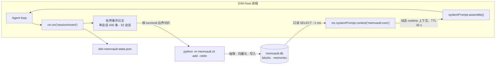

# dsh-memvault

<p align="center">
  <strong>把 MemVault 的核心记忆块推进 DeepSeek Harness 的 system prompt，再把每个完成的回合送回去。</strong><br>
  纯 host 插件 · 零运行时依赖 · 无需构建 · 无需第二个常驻服务
</p>

<p align="center">
  <a href="README.md">English</a> | <strong>中文</strong>
</p>

<p align="center">
  
  
  
  
  
  
</p>

---

**dsh-memvault** 补齐的是一个**已经存在**的记忆系统缺掉的那一半。**MemVault**（本机长期记忆服务：SQLite 库 + FastAPI/CLI 管线 + stdio MCP server）负责存事实、做向量化、做检索——但它是 **stdio MCP server**，而 MCP 是 *pull* 协议：服务端只能被**调用**，它没有任何渠道往模型上下文里放东西。所以「记忆已经在上下文里了」这件事，**在 MCP 这一层永远做不到**，只能由客户端插件来做。

本插件做两件方向相反的事：

| 半边 | 做什么 | 机制 |
|---|---|---|
| **注入（读）** | 核心记忆块进入 system prompt，**每一步**都看得到，模型不必调用任何工具 | `ctx.systemPrompt.context()` —— 动态 runtime 上下文贡献（与 `skill-catalog` 同一条通道） |
| **抽取（写）** | 每 *N* 个完成的回合，把这轮对话交给 MemVault 的抽取/向量化管线 | `ctx.on('session/event')` → `turn/end` → `python -m memvault.cli add --stdin` |

## ✨ 特性

| | |
|---|---|
| 🧠 **不靠工具调用的注入** | 核心块落在一个动态 runtime 上下文里，每次 `assemble()` 都会求值——模型是「本来就有」，不是「去拿」 |
| 🗄️ **直读 SQLite（只读）** | 用 Node 内置的 `node:sqlite` 只读打开 `memvault.db`：不过 HTTP、不起子进程、无第三方依赖，也不需要任何服务在跑 |
| 💾 **渲染结果按 TTL 缓存** | system prompt 就是 **KV cache 的前缀**：每步重读重渲染是白费，而任何一个字节变化都会让缓存从该点起失效。所以渲染被缓存（`refreshMs`，默认 30 秒） |
| 🧩 **按回合边界切片** | 写半边从自己那份有界事件日志里按 `turn/end` 边界切回合：幂等、跨重启稳定、没有会过期失准的水位算术 |
| ⏱️ **把成本做成旋钮** | `everyNTurns` 控 Python 进程频率，`minTranscriptChars` 跳过琐碎回合，`endReasons` 决定哪些结束方式算数，`timeoutMs` 杀掉卡住的子进程 |
| 🎭 **角色过滤** | 默认不送助手台词与工具流量——送它们曾把模型自己的话存成「关于用户的事实」 |
| 🪶 **零运行时依赖** | 就是 harness 插件协议上的裸 ESM：`node:sqlite`、`node:child_process`、`node:fs`。没有要装的东西，也没有要构建的步骤 |
| 🖥️ **纯 host bundle** | 没有 `dsh.client` 半边，因此没有浏览器产物、不需要 `pnpm run build`、没有 HMR 接收端：任何 DSH 形态都可用，包括无头的 |
| 🛟 **设计上软失败** | 库读不了就继续供上一次的好文本并只告警一次；抽取失败绝不让一轮对话失败，也不会污染下一轮 |
| 🔍 **可在进程外观测** | 水位与最近 5 次抽取诊断原子写入一个 JSON 文件，于是「钩子没触发」「回合太短」「跑了但没抽到」三者可区分 |

## 🧭 兼容性

| 问题 | 结论 |
|---|---|
| **DSH 桌面端** | ✅ 已在保留的 `desktop` profile 上**实测**：bundle（`dsh.bundle.patch`）加载成功，插件行状态 `active`，注入的块出现在 runtime 上下文快照里。 |
| **需要客户端半边吗？** | 不需要。这是纯 host bundle：`package.json` 没有声明 `dsh.client`，所以没有浏览器产物要构建，也没有需要跟着 Web 外壳同步的东西。 |
| **Web / 无头 / SDK profile** | ✅ 只要 host 在跑，同一个 bundle 就能用——注入贡献是 host 侧的。它只注入一个服务：`systemPrompt`。 |
| **有可见的界面吗？** | ❌ GUI 里什么都没有：没有设置页，也没有会话环面板。唯一的可见痕迹只有三处——执行轨迹「上下文注入」列表里的一条 `memvault:core`、Plugins 页上的插件行、以及那个状态 JSON。客户端半边在[路线图](#-路线图)里。 |
| **Windows / macOS / Linux** | ✅ Windows 用作者本机布局即可开箱；其它平台把 `MEMVAULT_DIR` / `MEMVAULT_PYTHON` 指向你的 checkout（POSIX 的 venv 是 `.venv/bin/python`），或在 `cordis.patch.yml` 里写死那三个路径。 |
| **Node** | `>= 22.13`（`node:sqlite` 无需标志）。DSH 自带 Node，所以这条只是本插件的 API 下限声明。 |
| **其它 harness（Claude Code、Codex…）** | ❌ 不是这个插件的事。它是照着 cordis/DSH 的接口写的（`ctx.systemPrompt.context`、`session/event`）。那些 harness 访问同一个库，走 MemVault 自己的 MCP 工具、CLI 或 API。 |

## 🚀 快速开始

**前置条件**：一份能跑的 MemVault checkout——它的 virtualenv 与 `memvault.db`（该库与 MemVault 服务、MCP 客户端共享；本插件只对它 `SELECT`）。

本机自持式安装（也就是本仓库在作者机器上的装法）：

```jsonc
// ~/.dsh/profiles/<profile>/package.json
{
  "dependencies": { "dsh-memvault": "link:D:/_Projects/skill_mcp/dsh-memvault" },
  "dsh": { "profile": { "bundles": ["…", "dsh-memvault", "…"] } }
}
```

```powershell
# 让 profile 能按包名解析到模块
New-Item -ItemType Junction `
  -Path "$env:USERPROFILE\.dsh\profiles\desktop\node_modules\dsh-memvault" `
  -Target "D:\_Projects\skill_mcp\dsh-memvault"
```

**新增 bundle 后要重启 DSH** —— 改已加载的 patch 文件是热重载，新加的 bundle 不是。

> ⚠️ 两个已知坑。`dsh plugin add` 会重写 profile 的 `package.json`，而 `dsh.profile.bundles` 数组可能**静默丢掉其他插件的条目**——改完务必核对整份清单。另外 pnpm 可能替换掉 `link:` 的 junction，bundle 突然不加载时先重建它。

从 npm 或 git 地址安装是同一个操作，走 `dsh plugin` 或 Web 侧边栏的 **Plugins** 页（见 `@deepseek-ai/dsh-plugin-manager`）。

## ⚙️ 配置

所有值都有代码默认；在 `cordis.patch.yml` 里给 `config` 即可覆盖。

### 读半边

| 字段 | 默认 | 说明 |
|---|---|---|
| `enabled` | `true` | 关掉则恒注入空串 |
| `dbPath` | `$MEMVAULT_DB_PATH`，否则 `D:/Claude_code/memory/data/memvault.db` | `memvault.db` 的路径 |
| `scopes` | `[{user,lenovo},{agent,claude-code-memory}]` | 核心块按 `(scope_type, scope_id)` 键控，**两边都必须显式给**——外部进程没有「当前作用域」 |
| `labels` | `[]` | 只注入这些 label；空 = 该作用域下全部块 |
| `maxChars` | `4000` | **整串**预算（含 header） |
| `refreshMs` | `30000` | 渲染缓存的 TTL |
| `order` | `210` | 在 runtime 上下文里的排序（相对 `skill-catalog` 等的先后） |
| `name` | `memvault:core` | 出现在轨迹「上下文注入」里的名字 |

### 写半边（`config.extract`）

| 字段 | 默认 | 说明 |
|---|---|---|
| `enabled` | `true` | 关掉则完全只读 |
| `everyNTurns` | `3` | 每 N 个**已完成**的回合抽取一次；`1` = 每轮 |
| `endReasons` | `['completed','max-tokens']` | 哪些 `turn/end` 原因算数。`aborted` / `error` / `interrupted` / `blocked` 默认跳过——但 `max-tokens` **不跳**，被截断的回合里同样有真实的用户内容 |
| `includeAssistant` / `includeTools` | `false` / `false` | 抽取器不区分角色，助手台词曾被存成「事实」，所以默认关 |
| `maxInputChars` | `6000` | 转写文本预算；取最新的行，旧行先丢 |
| `minTranscriptChars` | `40` | 低于此值不值得起进程 + 调 LLM，直接跳过（水位仍推进，不会重复挖） |
| `timeoutMs` | `120000` | 超时即杀，只记一条告警 |
| `pythonPath` | `$MEMVAULT_PYTHON`，否则 `<MEMVAULT_DIR>/.venv/{Scripts/python.exe, bin/python}` | 能 `import memvault` 的解释器 |
| `projectDir` | `$MEMVAULT_DIR`，否则 `D:/Claude_code/memory` | 子进程工作目录 |
| `user` / `agent` / `run` | `lenovo` / `claude-code-memory` / 空 | 三元组是**正交的，可以同时给** |
| `env` | `{PYTHONUTF8:'1', PYTHONIOENCODING:'utf-8'}` | 子进程环境变量；去掉它们会重现下面那条 cp936/emoji 坑 |
| `statePath` | `~/.dsh/storages/dsh-memvault-state.json` | 水位 + 最近 5 次诊断；原子写 |

## 🏗️ 工作原理



读路径，每一步：

1. `assemble()` 向每个动态上下文要文本。
2. `memvault:core` 返回缓存渲染，除非 TTL 到期；到期则只读打开库重新渲染。
3. 块渲染成 `- [scope_type/scope_id/label] value`，前面一行归属说明，整体受 `maxChars` 约束。
4. 渲染为空时返回 `''`，组装器会丢弃空贡献，轨迹里也就不会出现这一条——这是空库的预期行为，不是故障。

写路径，每个完成的回合：

1. 每个追加的会话事件都按会话缓冲（两个维度都有上限）。
2. 收到原因可接受的 `turn/end` 时，回合计数推进。
3. 每到第 `everyNTurns` 个回合，从缓冲区里**按回合边界**切片，渲染成只含用户的转写文本（旧行先丢），够长才入队。
4. 抽取串行化：同一时刻只有一个子进程，且一轮失败不会污染下一轮。
5. 剩下交给 MemVault——LLM 抽取、ADD/UPDATE/DELETE 决策、向量化、关系——所以写进去的行**检索得到**。

## 🧪 验证

不需要 DSH 就能跑：

```bash
npm test              # 三个套件全跑
npm run smoke:package # 包/bundle 契约：manifest、patch 行、导出、peer 声明
npm run smoke         # 读取器 / 格式化器 / 预算契约（对真实库只读）
npm run smoke:extract # 转写渲染 / 边界切片 / 事件缓冲 / 水位 + 真实端到端写入（临时库）
```

端到端那一步在临时库里强制使用离线 embedder 与规则抽取器：不碰真实库，也不调用 .env 里配置的网关。

**装机后的实测**：重启后执行轨迹的「上下文注入」列表里会多出一条 `memvault:core`，内容就是你的核心块；Plugins 页上能看到 bundle 的行（`memvault-core-context`）为 active。`~/.dsh/storages/dsh-memvault-state.json` 报告写半边的结果：`skipped: transcript below minTranscriptChars`、`ok added=N`，或 `failed: …`。

## 🧠 关键取舍

**为什么直读 SQLite，而不是走 HTTP 或 CLI。** `GET /api/v1/blocks` 需要 FastAPI 服务活在 8780 上——它挂了，提示词就**静默**丢掉记忆。起 CLI 每次刷新约 200–300 ms。`node:sqlite` 约 1 ms，且不依赖任何东西在跑。库与 MemVault 服务共享，但这里只 `SELECT`；`timeout: 2000` 是 busy timeout，避免并发写者把 `SQLITE_BUSY` 抛给提示词组装器。`node:sqlite` 在 Node 24 仍标注 *experimental*——这是被记录下来的风险，也是写半边刻意不依赖它的原因。

**为什么渲染要缓存。** system prompt 是 KV cache 的前缀。每步重读重渲染是白费，而且任何字节变化都会让该点之后的缓存复用失效。核心块是**人以小时为尺度**修改的东西，30 秒 TTL 既便宜又对缓存友好。

**为什么写半边走 CLI 而不是直写库。** 直接写行会**跳过抽取与向量化**——行是存在了，但检索不到。用 `--stdin` 而不是 argv，因为整轮对话远超命令行长度上限。代价是每抽取一轮一个 Python 进程，这正是 `everyNTurns` 与 `minTranscriptChars` 存在的理由。

**为什么只注入核心块，不做每轮语义召回。** 召回结果每轮都变，放进 system prompt 前缀会**每步**让缓存失效。那部分内容应该走带来源的 user 消息，而不是提示词前缀。

**为什么 `turn/end` 原因可配置。** Agent loop 会发 `completed`、`max-tokens`、`blocked`、`aborted`、`error`，修复路径另有 `interrupted`。只收 `completed` 会**静默丢掉**以 `max-tokens` 结束的回合——那里面同样有真实的用户内容。

## ⚠️ 已知边界

- **没有抽取窗口。** 抽取是同步的、只送单轮。攒够多轮再异步跑会更省成本、信噪比也更好；现在的缓解手段是 `includeAssistant: false`。
- **源码改动需要真正重启 host。** 改插件自己的 `lib/*.js`（或它的配置）只有进程真重启才会加载——「刷新界面」不算，症状就是*什么都没变*。
- **`node:sqlite` 仍是 experimental**（DSH 当前自带的 Node 版本就是如此）。
- **默认值带本机信息。** `scopes` 默认是作者的 `(user, lenovo)` / `(agent, claude-code-memory)`，随包附带的 patch 指向作者的 checkout。两处都是给你改的。

## 🗺️ 路线图

- **补一个客户端半边** —— 会话页面板里显示「当前注入了哪些块」和「最近几次抽取的结果」，也就是今天只存在于 JSON 文件里的那点可观测性。
- **异步 + 窗口化抽取** —— 攒够 N 轮或空闲时后台跑。
- **配置 schema** —— 让 Plugins 页能直接编辑这些旋钮，而不是手写 patch。

## 📄 许可

[MIT](./LICENSE) © 2026 zhang66633

每一次走进死路、每一个实测出来的坑，都记在 [docs/DEVLOG.md](docs/DEVLOG.md) 里。
